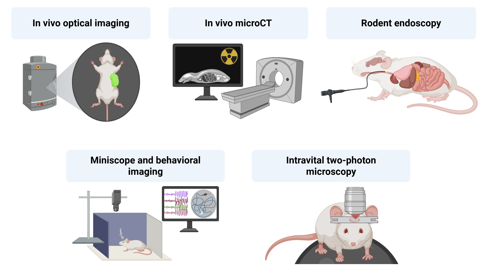

SAI Lab Presentation
####################

Established in 2023, the Small Animal Imaging Laboratory (SAI) at New York University Abu Dhabi (NYUAD) is a state-of-the-art
research facility dedicated to advancing biomedical research through small animal imaging. Located within an **AAALAC-accredited**
**vivarium**, the laboratory provides a comprehensive suite of in vivo and ex vivo imaging modalities, encompassing anatomical,
structural, functional, and molecular imaging techniques. These advanced imaging capabilities enable high-resolution, non-invasive
investigations in preclinical models and are readily available to researchers at NYUAD.

*SAI Technology overview*

.. raw:: html

SAI capabilities and services
*****************************
Imaging equipment
=================
The SAI core facility houses the following advanced imaging systems:

- **Optical Imaging System** – IVIS Spectrum (Revvity)
- **Micro-Computed Tomography** (microCT) – SkyScan 1276 (Bruker)
- **Customized Rodent Endoscope** – Karl Storz
- **Miniscope and Behavioral Imaging Platform** – nVue and nVision (Inscopix)

The instrumentation at the SAI facility supports both in vivo live animal imaging and ex vivo specimen investigations.
The IVIS Spectrum and SkyScan 1276 systems are equipped with integrated isoflurane anesthesia delivery, stage temperature
control, and physiological monitoring features, including ECG and respiratory monitoring (microCT only).

Applications
============
The advanced imaging systems available at the SAI enable a wide range of preclinical research applications, including
but not limited to:

- **Structural Imaging**
    - High-resolution bone and soft tissue imaging
    - Pulmonary and cardiovascular disease models
    - Anatomical assessment of implants and biomaterials
- **Functional Imaging**
    - Brain activity in freely moving animals
    - Behavioral neuroscience and circuit-level studies
    - Pulmonary and gastrointestinal function assessment
- **Molecular Imaging**
    - Tumor growth, metastasis, and therapy monitoring
    - Immune response and inflammation tracking
    - Gene expression and reporter imaging
    - Biodistribution and pharmacokinetics of drugs

Research support and services
=============================
In addition to imaging services, the facility offers expert consultation, specialized training in the operation of imaging
equipment, and support for data acquisition, processing, and analysis. Furthermore, it provides researchers with secure
data storage and access to high-performance computing resources. These comprehensive capabilities support the design
and implementation of longitudinal studies investigating disease progression, therapeutic efficacy, and molecular
mechanisms in murine models (mice and rats).

Core acknowledgements
*********************
All publications (manuscripts, abstracts, presentations, posters...) based on work conducted in the SAI Core should
acknowledge NYUAD Core Technology Platforms.
A suggested statement is as follows:
*"This research was partially carried out using the Core Technology Platforms resources at New York University Abu Dhabi."*

In addition, if CTP Scientists/Specialists provide significant experimental design, data interpretation, or other
intellectual contribution as evaluated by the PI, then it is appreciated if these individuals are considered as coauthors
on the publications.

