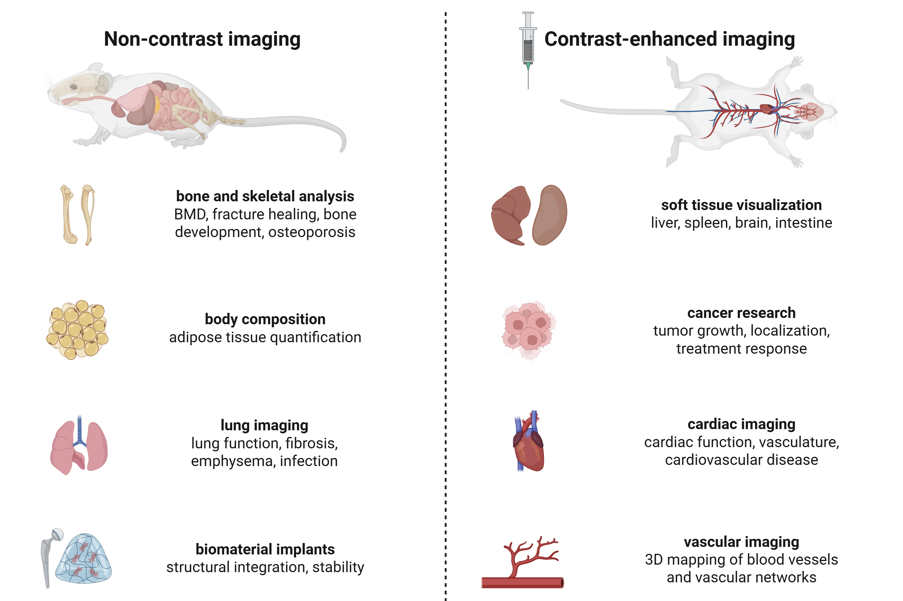

SkyScan 1276 (Bruker)
#####################
.. image:: ../_static/SkyScan1276.jpg
   :alt: *SkyScan 1276*
   :width: 1000px
   :align: center

*SkyScan 1276*

.. raw:: html

For a comprehensive explanation of microCT principles, see :doc:`In vivo microCT <3-Technology Principles/MicroCT>`.

SkyScan 1276 applications
*************************
The main application of the SkyScan 1276 is non-invasive in vivo micro-computed tomography (microCT) imaging for
**visualizing anatomical structures** in small animal models with high spatial resolution. Its ability to capture detailed
**3D images of bone and soft tissue**, combined with fast scanning speeds and low radiation doses, makes it especially
powerful for longitudinal studies of disease progression, treatment response, and physiological changes over time in live animals.

*Common applications of in vivo microCT*

.. raw:: html

System specifications
*********************

Available accessories
*********************

