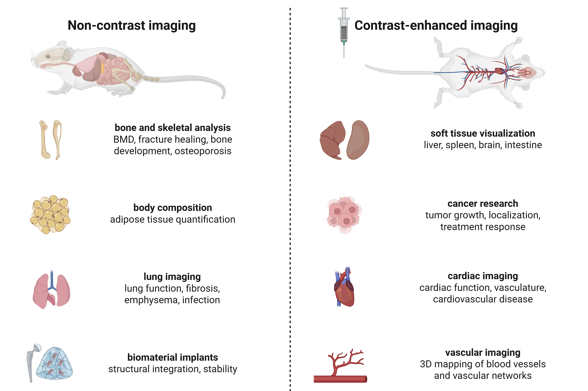
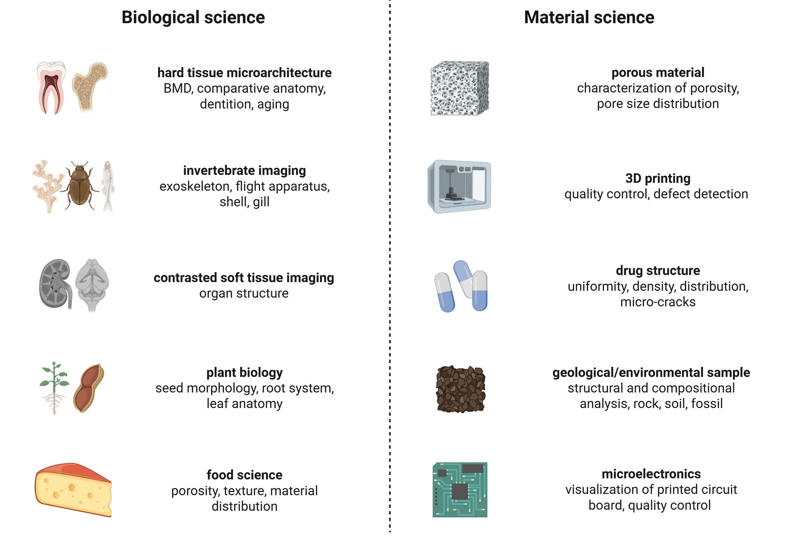

SkyScan 1276 (Bruker)
#####################
.. image:: ../_static/SkyScan1276.jpg
   :alt: *SkyScan 1276*
   :width: 1000px
   :align: center

*SkyScan 1276*

.. raw:: html

For a comprehensive explanation of microCT principles, see :doc:`In vivo microCT <3-Technology Principles/MicroCT>`.

SkyScan 1276 applications
*************************
The main application of the SkyScan 1276 is non-invasive in vivo micro-computed tomography (microCT) imaging for
**visualizing anatomical structures** in small animal models with high spatial resolution. Its ability to capture detailed
**3D images of bone and soft tissue**, combined with fast scanning speeds and low radiation doses, makes it especially
powerful for longitudinal studies of disease progression, treatment response, and physiological changes over time in live animals.

In vivo microCT imaging
=======================

*Common applications of in vivo microCT*

.. raw:: html

Here are common applications of in vivo microCT imaging:

- Bone morphometry
    - Analysis of bone microarchitecture and bone mineral density (BMD)
    - Studies of osteoporosis, bone healing, growth, and regeneration
- Lung imaging
    - Functional respiratory analysis using respiratory gating (4D microCT)
    - Monitoring pulmonary disease progression (fibrosis, emphysema, tumor, tuberculosis)
- Body composition analysis
    - Quantification of adipose tissue
    - Quantification of muscular tissue
- Biomaterial implant evaluation
    - Assessment of biocompatibility, structural integrity, and stability of implants
- Soft tissue visualization (contrast agent)
    - Morphological and structural analysis of liver, spleen, and kidneys
    - Volumetric analysis of soft tissue organs
- Cancer research (contrast agent)
    - Monitoring tumor growth, localization, and vascularization
    - Evaluating efficacy of anti-cancer therapies
- Cardiac imaging (contrast agent)
    - Functional cardiac analysis with cardiac gating (4D microCT)
    - Tracking cardiovascular disease progression (atherosclerosis, aneurysms, stroke)
- Vascular imaging (contrast agent)
    - 3D mapping and quantification of blood vessels and vascular networks

Additional microCT applications
===============================

*Common applications of microCT for biological and material science*

.. raw:: html

Here are some biological research applications of microCT imaging:

- Hard tissue micro-architecture
    - Comparative anatomy studies
    - Dental structure and development
    - Aging-related skeletal changes
- Invertebrate imaging
    - Visualization of exoskeletons, flight apparatus, shells, and gills
- Contrast-enhanced soft tissue imaging
    - High-resolution visualization of internal organ structures
- Plant biology
    - Seed morphology and development
    - Root system architecture
    - Leaf anatomy and venation patterns

System specifications
*********************
X-ray source
============
- Type: Tungsten source
- Adjustable output:
    - Power: Up to 20W
    - Voltage: 40–100 kV
- Spot size: < 5 µm at 4 W
- Automated 6-position filter changer
    - No filter, Al 0.25mm, Al 0.5mm, Al 1mm, Al+Cu, low dose

X-ray detector
==============
- Sensor type: 16 megapixels CMOS camera
- Resolution:
    - Sensor dimensions: 4096 × 4096 pixels
    - Pixel size: 2.8 µm to 75 µm
- Spatial resolution: 6 µm
- Sensor binning: up to 8x (512 x 512 pixels)
- Capability: Wide scan mode for large object

Imaging chamber
===============
- Temperature-controlled platform for maintaining physiological conditions
- Integrated gas anesthesia system
- Radiation Shielding: fully enclosed X-ray-safe chamber
- Live Animal Monitoring: 5 MP color visible-light camera for real-time monitoring
- Respiratory monitoring with breathing detection
- Object capacity: up to 310 mm height and 75 mm diameter

Rotation mechanics
==================
- Adjustable rotation steps: from 0.1 to 1° steps
- Rotation range: 180 and 360° option

Software suite
==============
- SkyScan 1276 - data acquisition platform
- NRecon - reconstruction and pre-processing
- Dataviewer - Slice-by-slice inspection and registration tools
- CTVox - High-quality volume rendering
- CTAn - Advanced 2D/3D image analysis & quantification
- CTVol - Surface model visualization and export (CAD/3D printing)

Available accessories
*********************
- Hydroxyapatite phantoms for BMD calibration with a 2-32 mm diameter range
- QRM phantom for spatial resolution calibration
- ECG patches for cardiac gating and physiological monitoring during in vivo imaging
- Real-time dose meter inside chamber for dose tracking
- Imaging cassettes of various diameters to accommodate
    - ex vivo sample
    - whole-body scans of mouse and rats
    - optimized specimen positioning

