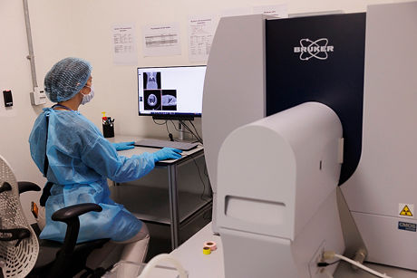

SkyScan 1276 (Bruker)
#####################

*SkyScan 1276*

.. raw:: html

For a comprehensive explanation of optical imaging principles, see :doc:`In vivo microCT <3-Technology Principles/MicroCT>`.

SkyScan 1276 applications
*************************

System specifications
*********************

Available accessories
*********************

