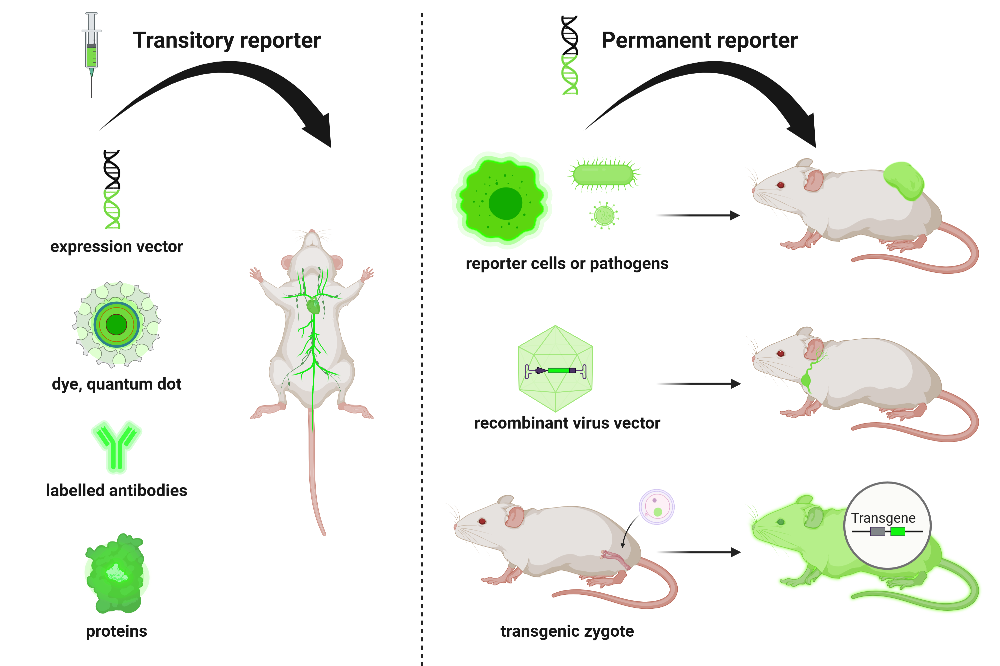

IVIS Spectrum - Main applications
=================================

The main application of the IVIS Spectrum is non-invasive in vivo optical imaging for **tracking biological processes** in
small animal models using **bioluminescence** and **fluorescence**. Its high sensitivity, spectral unmixing and 3D imaging
capabilities for bioluminescence and fluorescence approaches make it especially powerful for longitudinal studies in live animals.

*Commonly used reporter types in in vivo optical imaging*

.. raw:: html

Probe injection (transient signal)
----------------------------------
This approach involves the use of exogenous imaging agents that emit optical signals for a **limited duration** following administration.
These agents enable real-time imaging of **dynamic biological processes** without requiring genetic modification of the subject.

Commonly used probes include:

- **Fluorescent dyes** for vascular, tumor and metabolic imaging
- **Quantum dots** for multiplexed and photostable fluorescence detection
- **Nanoparticles** engineered for targeted delivery or biodistribution studies
- **Fluorescent/bioluminescent proteins** used as injectable markers
- **Labeled antibodies** targeting specific antigens (tumors or immune markers)
- **Fluorescently labeled/autofluorescent compounds/drugs** to assess pharmacokinetics, biodistribution and target engagement

These tools are widely used to investigate inflammation, infection, metabolic activity, tumor localization, and drug delivery
efficacy in live animal models.

Genetic engineering (stable expression)
---------------------------------------
This strategy relies on the **stable integration of reporter genes** into the genome of host organisms, cells, or pathogens
to enable longitudinal and repeated imaging over time. Endogenous expression of bioluminescent or fluorescent reporters
provides **continuous signal generation** under specific promoters.

Common genetic engineering approaches include:

- **Reporter cell lines** expressing luciferase/fluorescent proteins for tracking tumor cells, immune cells, or stem cells
- **Genetically modified pathogens** carrying reporter constructs to monitor infection dynamics and host-pathogen interactions
- **Recombinant viral vectors** delivering reporter genes to target tissues for functional or expression studies
- **Transgenic mouse models** expressing optical reporters under cell-type-specific or inducible promoters

These models enable non-invasive monitoring of gene expression, disease progression, and therapeutic response in preclinical research,
particularly in the fields of oncology, immunology, and neuroscience.