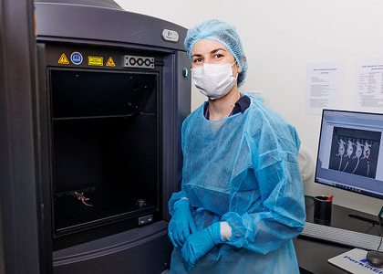

IVIS Spectrum (Revvity)
#######################

.. raw:: html

    

Introduction to optical imaging
*******************************

IVIS Spectrum applications
**************************
The main application of the IVIS Spectrum is non-invasive in vivo optical imaging for tracking biological processes in
small animal models using bioluminescence and fluorescence. Its high sensitivity, spectral unmixing and 3D imaging
capabilities for bioluminescence and fluorescence approaches make it especially powerful for longitudinal studies in live animals.

Probe injection (transient signal)
==================================
This approach involves the use of exogenous imaging agents that emit optical signals for a limited duration following administration.
These agents enable real-time imaging of dynamic biological processes without requiring genetic modification of the subject.

Commonly used probes include:

- Fluorescent dyes for vascular, tumor and metabolic imaging
- Quantum dots for multiplexed and photostable fluorescence detection
- Nanoparticles engineered for targeted delivery or biodistribution studies
- Fluorescent/bioluminescent proteins used as injectable markers
- Labeled antibodies targeting specific antigens (tumors or immune markers)
- Fluorescently labeled/autofluorescent compounds/drugs to assess pharmacokinetics, biodistribution and target engagement

These tools are widely used to investigate inflammation, infection, metabolic activity, tumor localization, and drug delivery
efficacy in live animal models.

Genetic engineering (stable expression)
=======================================
This strategy relies on the stable integration of reporter genes into the genome of host organisms, cells, or pathogens
to enable longitudinal and repeated imaging over time. Endogenous expression of bioluminescent or fluorescent reporters
provides continuous signal generation under specific promoters.

Common genetic engineering approaches include:

- Reporter cell lines expressing luciferase/fluorescent proteins for tracking tumor cells, immune cells, or stem cells
- Genetically modified pathogens carrying reporter constructs to monitor infection dynamics and host-pathogen interactions
- Recombinant viral vectors delivering reporter genes to target tissues for functional or expression studies
- Transgenic mouse models expressing optical reporters under cell-type-specific or inducible promoters

These models enable non-invasive monitoring of gene expression, disease progression, and therapeutic response in preclinical research,
particularly in the fields of oncology, immunology, and neuroscience.

System specifications
*********************
CCD camera
==========
- Back-thinned, back-illuminated Grade 1 CCD sensor
- Thermoelectric cooling to -90°C for low dark current and noise
- Pixel size: 13.5 µm
- Minimum pixel resolution: 20 µm
- Sensor dimensions: 2048 × 2048 pixels
- Maximum sensor binning: 16
- Quantum efficiency:
    - 85% in the 500–700 nm range
    - 30% in the 400–900 nm range

Lens
====
- 6-inch diameter optics
- Numerical aperture adjustable from f/1 to f/8
- Discrete magnifications: 1.5×, 2.5×, 5×, and 8.7×
- Corresponding fields of view: 3.9 cm to 22.5 cm
- High-resolution imaging down to 20 µm with small field of view

Optical path
============
- High-throughput imaging with a large field of view (up to 5 mice or 2 rats simultaneously)
- 10 high-efficiency narrow bandpass excitation filters (415–760 nm, 30 nm bandwidth)
- 18 high-efficiency narrow bandpass emission filters (490–850 nm, 20 nm bandwidth)
- Optical switch enabling both epi-illumination and trans-illumination fluorescence modes

Imaging stage
=============
- Temperature-controlled platform for maintaining physiological temperature during imaging
- Integrated RAS-4 gas anesthesia system
- light tight chamber

Software
========
- Spectral unmixing for separating multiple fluorescent or bioluminescent signals and background subtraction
- Co-registration with anatomical atlases or CT/MRI for overlaying structural and functional data
- 3D bioluminescence and fluorescence tomography with depth estimation and quantitative analysis
- Exportation of DICOM image format for 3D co-registration

Available accessories
*********************
- Fluorescence and bioluminescence phantom mouse for calibration
- Mouse Imaging Shuttle (MIS) for 3D multimodal co-registration with microCT or MRI systems

