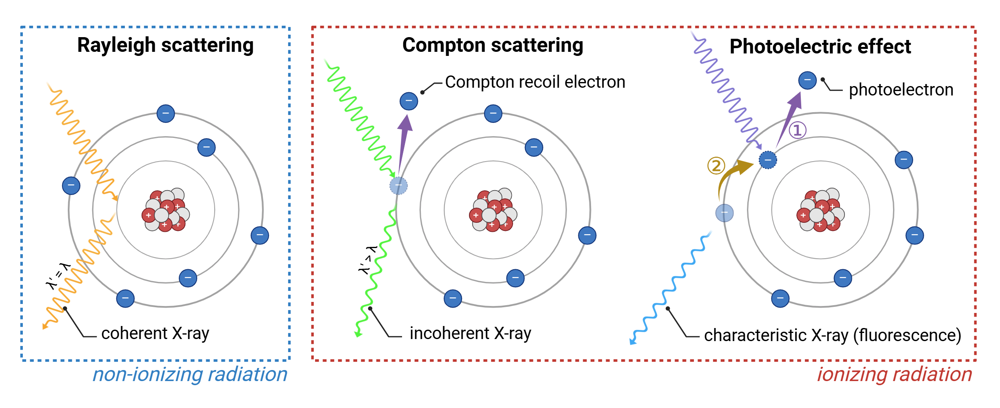

In vivo microCT
===============

Technology overview
-------------------
In vivo micro-computed tomography (microCT) is a powerful, non-invasive, non-destructive and high-resolution imaging modality
that allows for the **visualization and quantification of anatomical structures and physiological changes** in live animal models.
It operates by acquiring a **series of X-ray projections from multiple angles**. 2D projections are secondly reconstructed
into slice-by-slice cross-sectional images to provide a detailed **3D volumetric datasets** of internal features with micrometer-scale precision.

This technology is particularly advantageous in preclinical biomedical research due to its ability to provide **quantitative
structural information** from live rodents (mice and rats) without the need for surgical intervention or destructive sampling.
By enabling longitudinal studies, microCT allows researchers to follow **anatomical changes** over time in the same animal.
MicroCT excels in imaging **high-density tissues** such as bone, teeth, and implants, and can be extended to soft tissues using
contrast agents. Compared to optical imaging, microCT provides superior anatomical detail and penetration depth, though it
requires careful management of radiation dose for repeated in vivo applications.

Important considerations
^^^^^^^^^^^^^^^^^^^^^^^^

*Xray interaction with biological matter*

.. raw:: html

In vivo microCT enables high-resolution anatomical imaging in live animals, but its performance is shaped by the interaction
of ionizing X-rays (electromagnetic wavelengths between 0.01 - 10 nm) with biological tissues. These interactions affect
image contrast, radiation dose, and the reliability of longitudinal data, especially in soft tissue and high-resolution studies:

- **Rayleigh scattering**
Rayleigh scattering occurs predominantly at low photon energies, typically below 30 keV. In this process, X-ray photons are
coherently scattered—deflected by atoms without any energy loss or ionization. It is most prominent in low-density biological
tissues, such as fat and soft connective tissue, where loosely bound electron clouds enable elastic scattering through
induced dipole oscillations. Although no energy is transferred, the change in photon trajectory contributes to background
signal and spatial blurring. This effect is particularly noticeable at tissue interfaces and ultimately leads to a reduction
in spatial resolution.

- **Compton scattering**
Compton scattering is the dominant interaction within the typical energy range of in vivo microCT imaging, approximately
30 to 150 keV. It involves an inelastic collision between an X-ray photon and a loosely bound outer-shell electron. A
portion of the photon’s energy is transferred to the electron, which is ejected from the atom as a recoil electron. The
remaining energy is retained by the scattered photon of lower energy and longer wavelength. This ionizing process
is most prevalent in soft, lean tissues such as muscle, liver, and heart, which are primarily composed of low atomic number
elements (like hydrogen and carbon). The resulting recoil electrons additionally ionize surrounding molecules, leading
to the generation of reactive oxygen species and direct DNA strand breaks. These effects are particularly detrimental
in highly proliferative tissues such as bone marrow, gonads, skin, and intestinal epithelium, where they can lead to mutations,
impaired tissue regeneration, or cell death. Additionally, Compton scattering reduces image contrast and spatial resolution
due to photon absorption and angular deviation, ultimately contributing to signal degradation and image noise.

- **Photoelectric effect**
The photoelectric effect is an ionizing interaction that occurs predominantly at lower photon energies, typically between
20 and 60 keV, and is strongly dependent on the atomic number (Z) of the absorbing material. In this process, an X-ray
photon is fully absorbed by a tightly bound inner-shell electron, which is then ejected as a photoelectron. The resulting
shell vacancy is filled by an outer-shell electron, releasing a characteristic (fluorescent) X-ray. This secondary photon
may either escape, be reabsorbed via another photoelectric event, or undergo Compton or Rayleigh scattering, contributing
to localized dose or image noise.
This interaction enhances image contrast and spatial resolution due to the high differential absorption of X-rays by tissues
with varying atomic composition. As a result, large differences in X-ray attenuation arise between structures such as bone,
soft tissue, or contrast-enhanced regions (barium, gold, iodine), producing strong image contrast. Additionally, because
the incident X-ray is fully absorbed (with no scattered photon) there is no redirection of signal away from the detector
axis, minimizing image blurring and improving spatial accuracy. This effect is particularly pronounced at tissue interfaces,
where abrupt changes in density or composition lead to edge enhancement. These transitions enhance boundaries between
adjacent voxels, creating both perceived and true spatial resolution gains in the final image. However, the photoelectric
effect also contributes significantly to radiation dose and localized ionization. The energy deposited by photoelectrons
and subsequent secondary interactions may lead to tissue damage, particularly in radiosensitive organs (bone marrow, osteogenic tissue)).
Therefore, its benefits must be balanced against biological risks, especially in longitudinal or high-dose imaging protocols.

*Comparative overview of X-ray interactions with biological tissue*

.. raw:: html

- **Biological impact of ionizing radiation**
Ionizing radiation occurring during in vivo microCT imaging leads to the formation of ROS and induces direct DNA strand
breaks. These effects directly contribute to genetic mutations, impaired tissue regeneration, and cell death. In highly
proliferative tissues, these outcomes are particularly detrimental. Repeated or excessive exposure in these radiosensitive
regions can significantly increase the risk of tumor formation, developmental abnormalities, and reproductive system
malformations, especially when imaging protocols are not optimized. Importantly, maintaining the lowest possible radiation
dose should be a fundamental priority in in vivo studies, particularly when scans are repeated over short intervals or
conducted during sensitive developmental windows.

MicroCT imaging
---------------

Xray production
^^^^^^^^^^^^^^^

Advanced techniques for microCT imaging
^^^^^^^^^^^^^^^^^^^^^^^^^^^^^^^^^^^^^^^

Respiratory gating
""""""""""""""""""

Cardiac gating
""""""""""""""

Advantages of microCT
^^^^^^^^^^^^^^^^^^^^^

Limitations of microCT
^^^^^^^^^^^^^^^^^^^^^^

Best practices for optimizing microCT scanning
----------------------------------------------

