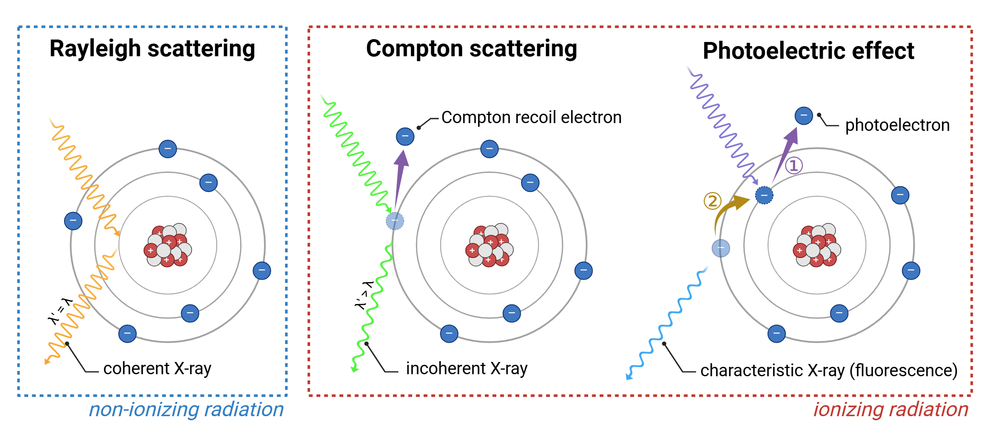

In vivo microCT
===============

Technology overview
-------------------
In vivo micro-computed tomography (microCT) is a powerful, non-invasive, non-destructive and high-resolution imaging modality
that allows for the **visualization and quantification of anatomical structures and physiological changes** in live animal models.
It operates by acquiring a **series of X-ray projections from multiple angles**. 2D projections are secondly reconstructed
into slice-by-slice cross-sectional images to provide a detailed **3D volumetric datasets** of internal features with micrometer-scale precision.

This technology is particularly advantageous in preclinical biomedical research due to its ability to provide **quantitative
structural information** from live rodents (mice and rats) without the need for surgical intervention or destructive sampling.
By enabling longitudinal studies, microCT allows researchers to follow **anatomical changes** over time in the same animal.
MicroCT excels in imaging **high-density tissues** such as bone, teeth, and implants, and can be extended to soft tissues using
contrast agents. Compared to optical imaging, microCT provides superior anatomical detail and penetration depth, though it
requires careful management of radiation dose for repeated in vivo applications.

Important considerations
^^^^^^^^^^^^^^^^^^^^^^^^

*Xray interaction with biological matter*

.. raw:: html

In vivo microCT enables high-resolution anatomical imaging in live animals, but its performance is shaped by the interaction
of ionizing X-rays (electromagnetic wavelengths between 0.01 - 10 nm) with biological tissues. These interactions affect
image contrast, radiation dose, and the reliability of longitudinal data, especially in soft tissue and high-resolution studies:

- **Rayleigh scattering**
Rayleigh scattering occurs predominantly at low photon energies, typically below 30 keV. In this process, X-ray photons are
coherently scattered—deflected by atoms without any energy loss or ionization. It is most prominent in low-density biological
tissues, such as fat and soft connective tissue, where loosely bound electron clouds enable elastic scattering through
induced dipole oscillations. Although no energy is transferred, the change in photon trajectory contributes to background
signal and spatial blurring. This effect is particularly noticeable at tissue interfaces and ultimately leads to a reduction
in spatial resolution.

- **Compton scattering**
Compton scattering is the dominant interaction within the typical energy range of in vivo microCT imaging, approximately
30 to 150 keV. It involves an inelastic collision between an X-ray photon and a loosely bound outer-shell electron. A
portion of the photon’s energy is transferred to the electron, which is ejected from the atom as a recoil electron. The
remaining energy is retained by the scattered photon of lower energy and longer wavelength. This ionizing process
is most prevalent in soft, lean tissues such as muscle, liver, and heart, which are primarily composed of low atomic number
elements (like hydrogen and carbon). The resulting recoil electrons additionally ionize surrounding molecules, leading
to the generation of reactive oxygen species and direct DNA strand breaks. These effects are particularly detrimental
in highly proliferative tissues such as bone marrow, gonads, skin, and intestinal epithelium, where they can lead to mutations,
impaired tissue regeneration, or cell death. Additionally, Compton scattering reduces image contrast and spatial resolution
due to photon absorption and angular deviation, ultimately contributing to signal degradation and image noise.

- **Photoelectric effect**
The photoelectric effect is an ionizing interaction that occurs predominantly at lower photon energies, typically between
20 and 60 keV, and is strongly dependent on the atomic number (Z) of the absorbing material. In this process, an X-ray
photon is fully absorbed by a tightly bound inner-shell electron, which is then ejected as a photoelectron. The resulting
shell vacancy is filled by an outer-shell electron, releasing a characteristic (fluorescent) X-ray. This secondary photon
may either escape, be reabsorbed via another photoelectric event, or undergo Compton or Rayleigh scattering, contributing
to localized dose or image noise.
This interaction enhances image contrast and spatial resolution due to the high differential absorption of X-rays by tissues
with varying atomic composition. As a result, large differences in X-ray attenuation arise between structures such as bone,
soft tissue, or contrast-enhanced regions (barium, gold, iodine), producing strong image contrast. Additionally, because
the incident X-ray is fully absorbed (with no scattered photon) there is no redirection of signal away from the detector
axis, minimizing image blurring and improving spatial accuracy. This effect is particularly pronounced at tissue interfaces,
where abrupt changes in density or composition lead to edge enhancement. These transitions enhance boundaries between
adjacent voxels, creating both perceived and true spatial resolution gains in the final image. However, the photoelectric
effect also contributes significantly to radiation dose and localized ionization. The energy deposited by photoelectrons
and subsequent secondary interactions may lead to tissue damage, particularly in radiosensitive organs (bone marrow, osteogenic tissue).
Therefore, its benefits must be balanced against biological risks, especially in longitudinal or high-dose imaging protocols.

.. image:: ../_static/comparison-Xray-interaction.png
   :alt: *Comparative overview of X-ray interactions with biological tissue*
   :width: 1000px
   :align: center

*Comparative overview of X-ray interactions with biological tissue*

.. raw:: html

- **Biological impact of ionizing radiation**
Ionizing radiation occurring during in vivo microCT imaging leads to the formation of ROS and induces direct DNA strand
breaks. These effects directly contribute to genetic mutations, impaired tissue regeneration, and cell death. In highly
proliferative tissues, these outcomes are particularly detrimental. Repeated or excessive exposure in these radiosensitive
regions can significantly increase the risk of tumor formation, developmental abnormalities, and reproductive system
malformations, especially when imaging protocols are not optimized. Importantly, maintaining the lowest possible radiation
dose should be a fundamental priority in in vivo studies, particularly when scans are repeated over short intervals or
conducted during sensitive developmental windows.

MicroCT imaging
---------------

*In vivo microCT*

.. raw:: html

Xray generation
^^^^^^^^^^^^^^^
X-ray generation is a complex process in which electrons are thermionically emitted from a heated tungsten filament at the
cathode and **accelerated toward the anode under a high-voltage potential**, typically adjustable between 40 and 100 kV. The
accelerated electron beam is directed onto a **tungsten target**, selected for its high atomic number (Z = 74) and high melting point,
which together enable efficient X-ray production (0.01 - 10 nm) through two primary mechanisms:

- **Bremsstrahlung radiation** (Braking radiation) resulting from electron deceleration in the nuclear electric field
- **characteristic radiation** produced by inner-shell electron ionization followed by electron shell transitions

.. image:: ../_static/Xray-generation.png
   :alt: *Mechanisms of X-ray generation in a microfocus X-ray tube*
   :width: 1000px
   :align: center

*Mechanisms of X-ray generation in a microfocus X-ray tube*

.. raw:: html

Alternatively, lower-Z target materials such as copper or molybdenum may be employed in material science applications,
particularly in X-ray diffraction or the imaging of thin or low-density samples where softer X-rays are advantageous. However,
tungsten remains the predominant target material in both preclinical and clinical imaging systems due to its superior X-ray yield,
deeper tissue penetration, and high thermal resilience.

The tungsten target is embedded within a copper stem to facilitate rapid heat dissipation, and the anode assembly is actively
cooled to maintain focal spot sharpness and system stability during prolonged scans. The emitted X-ray beam then exits through
a diaphragm and passes through a motorized filter changer, which enables the **selection of beam-hardening filters** (aluminum,
copper, or Al+Cu combinations) to tailor spectral energy and minimize low-energy artifacts.

This entire process occurs within a **vacuum-sealed glass envelope**, ensuring efficient electron acceleration and minimizing
scattering losses. This configuration enables microCT systems to generate highly stable, low-noise X-ray
beams with adjustable resolution, dose, and energy settings, making them suitable for a **wide range of in vivo and ex vivo**
**biological imaging applications**.

Xray attenuation
^^^^^^^^^^^^^^^^
X-rays are attenuated as they pass through a sample due to their interactions with matter, primarily via **Rayleigh scattering**,
**Compton scattering**, and the **photoelectric effect**. Compton scattering dominates at higher photon energies and in
low-Z materials, while the photoelectric effect is more prevalent at lower energies and in high-Z substances. Rayleigh scattering,
though non-ionizing and elastic, contributes minimally to attenuation but can influence image quality through signal redirection.

The **degree of attenuation** is influenced by multiple factors, including **sample density**, **thickness**, **atomic composition (Z)**,
and the **energy of the incident X-ray beam**. This **partial and differential attenuation** of X-rays as they traverse various
tissues or materials forms the **physical basis of image contrast** in both X-ray radiography and computed tomography (CT).
Differences in attenuation coefficients among adjacent structures enable the visualization and distinction of internal
features, making attenuation a critical determinant of image quality.

Xray projection and detection
^^^^^^^^^^^^^^^^^^^^^^^^^^^^^
After passing through the specimen, the transmitted X-rays are incident on a **digital detector**, which converts the attenuated
X-ray intensity into a measurable two-dimensional image, referred to as a **projection**. The detector includes a **scintillator layer**,
a material capable of emitting visible light upon absorption of incoming X-ray photons, effectively converting X-ray energy
into a light signal. This light is subsequently detected by either a **flat-panel detector**, consisting of large-area photodiode
arrays suited for wide-field imaging, or a **scientific-grade CMOS or CCD sensor**, which converts the light into an electrical signal
whose intensity is directly proportional to the intensity of the transmitted X-rays.

These detectors capture the **spatial distribution of transmitted X-ray intensity** across the imaging plane with high
sensitivity and spatial resolution. However, conventional detectors operate in an **energy-integrating mode**, meaning they
accumulate the total signal from all incident photons without distinguishing their individual energies. As a result,
**no spectral or wavelength-specific information** is preserved, and the output reflects only the cumulative X-ray intensity or
**total photon flux**. This limitation reduces the ability to differentiate between materials with similar attenuation coefficients,
particularly when contrast depends on subtle energy-dependent interactions, and it contributes to imaging artifacts such as **beam hardening**.

To address this limitation, emerging technologies such as **spectral photon-counting CT** (SPCCT) enable the energy-resolved
detection of individual X-ray photons, providing **spectral information** in each projection. This capability allows for
improved material decomposition, artifact reduction, and potentially enhanced spatial and contrast resolution—especially
in soft tissue or contrast-enhanced imaging contexts. Although not yet standard in preclinical systems, SPCCT represents
a promising advancement in high-fidelity X-ray imaging.

Another approach to overcoming the limitations of energy-integrating detection consists of using **coherent, monochromatic X-rays**,
in which all photons possess a single, well-defined wavelength (or energy). This is typically achieved using **synchrotron radiation sources**
or advanced laboratory-based monochromators that filter polychromatic beams. By eliminating spectral heterogeneity, **monochromatic X-ray imaging**
minimizes beam hardening artifacts and improves the accuracy of quantitative measurements, especially in materials with
strong energy-dependent attenuation. Although not yet widely available in conventional microCT systems due to the complexity
and cost of monochromatic X-ray generation, this method offers significant advantages in high-precision material analysis and advanced contrast imaging.

Advanced techniques for microCT imaging
^^^^^^^^^^^^^^^^^^^^^^^^^^^^^^^^^^^^^^^

Respiratory gating
""""""""""""""""""

Cardiac gating
""""""""""""""

Advantages of microCT
^^^^^^^^^^^^^^^^^^^^^

Limitations of microCT
^^^^^^^^^^^^^^^^^^^^^^

Best practices for optimizing microCT scanning
----------------------------------------------

