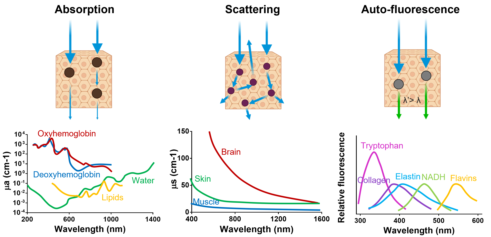
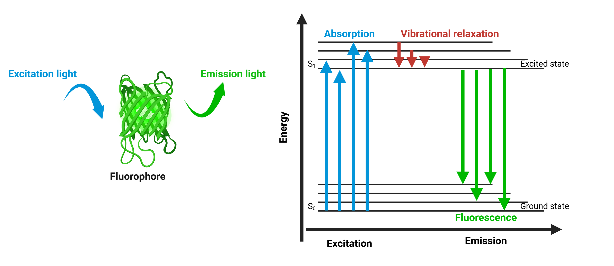
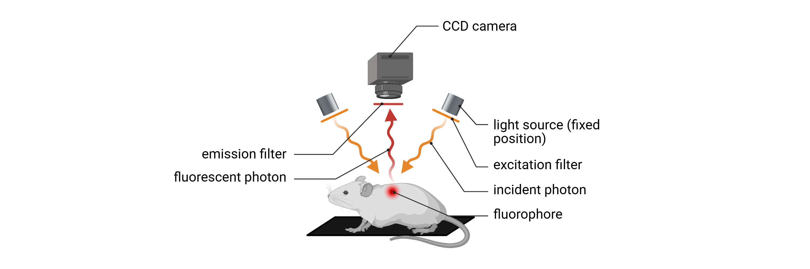

In vivo Optical Imaging
#######################

Technology overview
*******************
In vivo optical imaging is a versatile, non-invasive, non-destructive modality that enables the visualization and quantification of biological
processes in living organisms through the detection of emitted light generated from within the biological system.
This approach offers unique advantages for small-animal imaging, including high sensitivity, real-time monitoring, and
longitudinal assessment under physiological conditions.

In the context of preclinical biomedical research, in vivo optical imaging systems have become widely adopted for whole-body
imaging in small animal models such as mice and rats. Operating in the visible to far-red spectral range (450-900nm), these
systems provide an effective balance between spatial resolution, tissue penetration, high sensitivity, and minimal physiological disruption.
Their ability to conduct non-invasive, high-throughput, and longitudinal imaging makes them indispensable tools for monitoring
molecular and physiological events over time.

Two major emission-based imaging modalities dominate this field: fluorescence imaging and bioluminescence imaging.

Challenges
==========

*Light interaction with biological matter*

.. raw:: html

Non-invasive in vivo optical imaging provides a powerful platform for monitoring biological processes in live animals.
However, it faces several interrelated challenges, primarily arising from the interactions between visible-range photons
and biological tissues, which can affect imaging performance, spatial accuracy, and data interpretability:

- **Limited tissue penetration**
Both excitation and emission photons are subject to significant absorption and scattering by biological tissues.
This dramatically restricts photon penetration depth, particularly for visible-wavelength fluorophores or reporters,
thereby limiting the modality’s utility for imaging deep anatomical structures. To mitigate this limitation, far-red fluorescent
reporters with high brightness should be prioritized, as far-red signals (650–900 nm) penetrate more deeply into tissues (brain, lung, and liver).

*The optical window for in vivo optical imaging*

.. raw:: html

- **Limited spatial resolution**
Photon scattering in biological tissues limits the spatial resolution of in vivo optical imaging by reducing localization
accuracy, particularly for deep-seated emission sources. The deeper the signal origin, the more pronounced the scattering,
resulting in increased signal blurring and decreased anatomical precision. Bioluminescence imaging avoids autofluorescence
but suffers from low photon output and tissue scattering, which contribute to low spatial resolution and reduced signal localization accuracy.

- **Autofluorescence and background noise**
Endogenous tissue autofluorescence, primarily from skin, fur, and diet, reduces signal-to-noise ratios in fluorescence imaging.

- **Quantitative limitations**
Signal intensity is influenced by reporter brightness, depth, biological variability, and animal positioning, making
fluorescence and bioluminescence data semi-quantitative unless normalized with appropriate controls.

- **Substrate and probe delivery issues**
Bioluminescence imaging requires substrate administration (D-luciferin), and signal intensity is influenced by
delivery efficiency, biodistribution, metabolism, and perfusion. Moreover, because luciferase activity is dependent on
intracellular ATP and oxygen, the signal is sensitive to hypoxic or necrotic environments, potentially leading to variability
across tissues or in disease states. Similarly, fluorescent probes may suffer from non-specific distribution, poor bioavailability,
or off-target accumulation, all of which can compromise signal specificity. Optical signal propagation is further influenced by
tissue pigmentation, vascularization, and hydration.

- **Restricted multiplexing (bioluminescence)**
While fluorescence imaging supports multiplexing through spectral unmixing, enabled by the wide availability of spectrally
distinct reporters, bioluminescence imaging is limited by overlapping emission spectra and shared substrate requirements,
which constrain the ability to perform simultaneous multi-reporter imaging.

Fluorescence imaging
********************
Fluorescence imaging relies on the use of fluorophores (synthetic dyes, nanoparticles, or genetically encoded fluorescent
proteins) which are molecules capable of emitting light upon the absorption of photons at specific excitation wavelengths.
These fluorophores absorb light at a defined excitation wavelength and subsequently emit light at a longer wavelength due
to energy dissipation.

*Principle of fluorescence*

.. raw:: html

In in vivo imaging systems, excitation light is typically delivered using spectrally filtered light-emitting diodes (LEDs),
(AMI HT system), or via broadband white-light sources combined with excitation filters (IVIS Spectrum).
These illumination strategies enable selective excitation of fluorophores at their optimal wavelengths, enhancing specificity
and minimizing off-target activation. The resulting fluorescent photons are captured by highly sensitive, cooled charge-coupled
device (CCD) cameras after passing through wavelength-specific emission filters, which selectively isolate the desired signal.
This approach, employing narrow-band excitation and emission wavelengths, effectively minimizes background noise originating
from tissue autofluorescence and reduces spectral overlap between multiple fluorophores.

*2D in vivo fluorescence imaging: epi-illumination*

.. raw:: html

This modality enables the targeted visualization of specific biological structures or molecular events through the use of
fluorophores conjugated to targeting moieties such as antibodies, peptides, or receptor ligands. The use of far-red fluorophores,
typically within the 650–900 nm spectral range, enhances imaging performance by increasing tissue penetration and reducing
signal interference from endogenous tissue autofluorescence.

Advantages
==========

Disadvantages
=============

2D versus 3D tomography
=======================

.. image:: ../_static/trans-illumination.png
   :alt: *3D in vivo fluorescence molecular tomography: trans-illumination*
   :width: 1000px
   :align: center

*3D in vivo fluorescence molecular tomography: trans-illumination*

.. raw:: html

Bioluminescence imaging
***********************

*Principle of bioluminescence*

.. raw:: html

*2D in vivo bioluminescence imaging*

.. raw:: html

Advantages
==========

Disadvantages
=============

2D versus 3D tomography
=======================

Quick tips for in vivo optical imaging
**************************************
