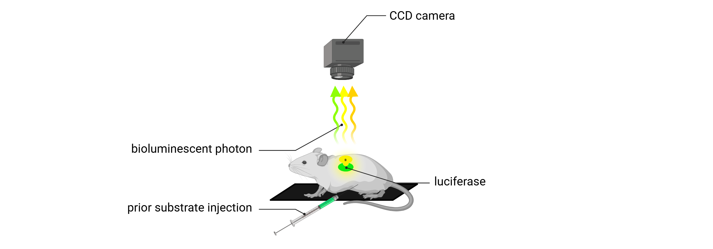
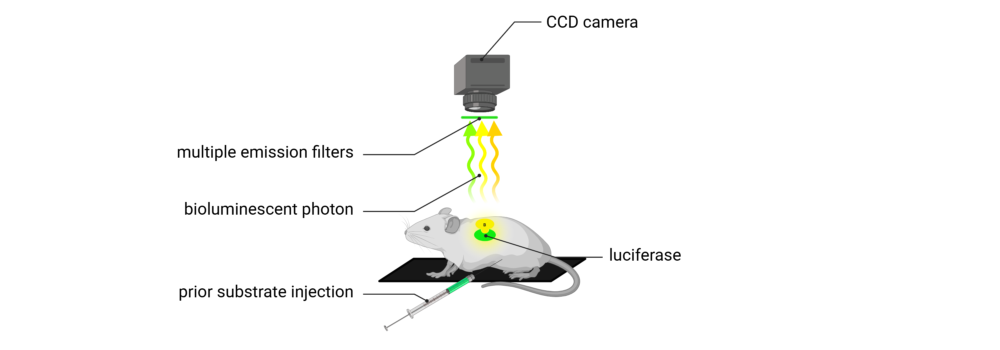

In vivo Optical Imaging
#######################

Technology overview
*******************
In vivo optical imaging is a versatile, non-invasive, non-destructive modality that enables the visualization and quantification of biological
processes in living organisms through the detection of emitted light generated from within the biological system.
This approach offers unique advantages for small-animal imaging, including high sensitivity, real-time monitoring, and
longitudinal assessment under physiological conditions.

In the context of preclinical biomedical research, in vivo optical imaging systems have become widely adopted for whole-body
imaging in small animal models such as mice and rats. Operating in the visible to far-red spectral range (450-900nm), these
systems provide an effective balance between spatial resolution, tissue penetration, high sensitivity, and minimal physiological disruption.
Their ability to conduct non-invasive, high-throughput, and longitudinal imaging makes them indispensable tools for monitoring
molecular and physiological events over time.

Two major emission-based imaging modalities dominate this field: fluorescence imaging and bioluminescence imaging.

Challenges
==========
.. image:: ../_static/light_interaction.png
   :alt: *Light interaction with biological matter*
   :width: 1000px
   :align: center

*Light interaction with biological matter*

.. raw:: html

Non-invasive in vivo optical imaging provides a powerful platform for monitoring biological processes in live animals.
However, it faces several interrelated challenges, primarily arising from the interactions between visible-range photons
and biological tissues, which can affect imaging performance, spatial accuracy, and data interpretability:

- **Limited tissue penetration**
Both excitation and emission photons are subject to significant absorption and scattering by biological tissues.
This dramatically restricts photon penetration depth, particularly for visible-wavelength fluorophores or reporters,
thereby limiting the modality’s utility for imaging deep anatomical structures. To mitigate this limitation, far-red fluorescent
reporters with high brightness should be prioritized, as far-red signals (650–900 nm) penetrate more deeply into tissues (brain, lung, and liver).

.. image:: ../_static/optical_window.png
   :alt: *The optical window for in vivo optical imaging*
   :width: 1000px
   :align: center

*The optical window for in vivo optical imaging*

.. raw:: html

- **Limited spatial resolution**
Photon scattering in biological tissues limits the spatial resolution of in vivo optical imaging by reducing localization
accuracy, particularly for deep-seated emission sources. The deeper the signal origin, the more pronounced the scattering,
resulting in increased signal blurring and decreased anatomical precision. Bioluminescence imaging avoids autofluorescence
but suffers from low photon output and tissue scattering, which contribute to low spatial resolution and reduced signal localization accuracy.

- **Autofluorescence and background noise**
Endogenous tissue autofluorescence, primarily from skin, fur, and diet, reduces signal-to-noise ratios in fluorescence imaging.

- **Quantitative limitations**
Signal intensity is influenced by reporter brightness, depth, biological variability, and animal positioning, making
fluorescence and bioluminescence data semi-quantitative unless normalized with appropriate controls.

- **Substrate and probe delivery issues**
Bioluminescence imaging requires substrate administration (D-luciferin), and signal intensity is influenced by
delivery efficiency, biodistribution, metabolism, and perfusion. Moreover, because luciferase activity is dependent on
intracellular ATP and oxygen, the signal is sensitive to hypoxic or necrotic environments, potentially leading to variability
across tissues or in disease states. Similarly, fluorescent probes may suffer from non-specific distribution, poor bioavailability,
or off-target accumulation, all of which can compromise signal specificity. Optical signal propagation is further influenced by
tissue pigmentation, vascularization, and hydration.

- **Restricted multiplexing (bioluminescence)**
While fluorescence imaging supports multiplexing through spectral unmixing, enabled by the wide availability of spectrally
distinct reporters, bioluminescence imaging is limited by overlapping emission spectra and shared substrate requirements,
which constrain the ability to perform simultaneous multi-reporter imaging.

Fluorescence imaging
********************
Fluorescence imaging relies on the use of fluorophores (synthetic dyes, nanoparticles, or genetically encoded fluorescent
proteins) which are molecules capable of emitting light upon the absorption of photons at specific excitation wavelengths.
These fluorophores absorb light at a defined excitation wavelength and subsequently emit light at a longer wavelength due
to energy dissipation.

.. image:: ../_static/fluorescence.png
   :alt: *Principle of fluorescence*
   :width: 1000px
   :align: center

*Principle of fluorescence*

.. raw:: html

In in vivo imaging systems, excitation light is typically delivered using spectrally filtered light-emitting diodes (LEDs),
(AMI HT system), or via broadband white-light sources combined with excitation filters (IVIS Spectrum).
These illumination strategies enable selective excitation of fluorophores at their optimal wavelengths, enhancing specificity
and minimizing off-target activation. The resulting fluorescent photons are captured by highly sensitive, cooled charge-coupled
device (CCD) cameras after passing through wavelength-specific emission filters, which selectively isolate the desired signal.
This approach, employing narrow-band excitation and emission wavelengths, effectively minimizes background noise originating
from tissue autofluorescence and reduces spectral overlap between multiple fluorophores.

.. image:: ../_static/epi-illumination.png
   :alt: *2D in vivo fluorescence imaging: epi-illumination*
   :width: 1000px
   :align: center

*2D in vivo fluorescence imaging: epi-illumination*

.. raw:: html

This modality enables the targeted visualization of specific biological structures or molecular events through the use of
fluorophores conjugated to targeting moieties such as antibodies, peptides, or receptor ligands. The use of **far-red fluorophores**,
typically within the 650–900 nm spectral range, enhances imaging performance by increasing tissue penetration and reducing
signal interference from endogenous tissue autofluorescence.

Traditionally, in vivo fluorescence imaging employs a **surface-based illumination** strategy, known as an **epi-illumination**
configuration**, in which both excitation and emission light paths originate from the same side of the animal (typically from the top).
While this setup is effective for detecting superficial signals, it offers limited sensitivity to fluorophores located deeper within
tissue. In contrast, some in vivo optical imaging systems implement a **transillumination-based configuration**, where
excitation light is delivered from the side opposite the detector. As the excitation light propagates upward through the tissue,
it is absorbed by fluorophores that emit photons detectable at the surface. This alternative approach improves sensitivity to deeper
tissue signals and enhances contrast and detection accuracy in 2D fluorescence imaging applications.

Spectral unmixing
=================

3D tomography (Fluorescence Molecular Tomography)
=================================================
.. image:: ../_static/trans-illumination.png
   :alt: *3D in vivo Fluorescence Molecular Tomography: trans-illumination*
   :width: 1000px
   :align: center

*3D in vivo Fluorescence Molecular Tomography: trans-illumination*

.. raw:: html

Three-dimensional (3D) fluorescence tomography is an advanced in vivo imaging technique that enables **volumetric localization**
and **quantification of fluorescent probes** within live animal models. A central feature of this modality is **transillumination scanning**,
in which excitation light is delivered from multiple positions beneath the animal, while emitted fluorescence is collected from above.
In this approach, a **series of 2D transillumination-based excitation and fluorescence images** are acquired by illuminating
the animal from various positions below the imaging platform. As the excitation source is systematically repositioned and
the detection geometry remains fixed, the system samples the entire volume of interest through **multiple excitation–emission pairings**.
Prior to fluorescence acquisition, a **surface topography scan** is performed using structured light projection to reconstruct
the animal’s external 3D geometry, which serves as the anatomical framework for tomographic reconstruction.
To estimate fluorophore distribution, the system integrates **transmitted excitation and fluorescence emission images** with **topographical data**
as input to the tomographic reconstruction process, which begins by **modeling the propagation of incident (excitation) light**
through tissue. This step accounts for photon scattering and absorption to estimate the local excitation fluence (the photon density
delivered per unit area at each location within the subject). Next, the emitted fluorescent photons, generated isotropically,
are modeled as they propagate through tissue toward the detector. A **diffusion-based photon propagation model** is employed
to solve the **inverse problem of source localization**, integrating surface-detected signals with tissue optical properties.
The resulting **3D fluorescence map** enables quantitative assessment of **probe concentration and depth**, providing a
spatially resolved representation of fluorophore distribution.

Fluorescence tomography with transillumination scanning significantly enhances sensitivity to deep-tissue signals and
enables non-invasive, quantitative imaging of biological processes over time. Despite its limited throughput and longer
acquisition time, this method is particularly well-suited for longitudinal studies involving orthotopic tumor progression
in deep tissues, drug biodistribution, and cellular or molecular tracking in preclinical research settings.

Advantages of fluorescence imaging
==================================
- **Multiplexing capability**
Fluorescence imaging supports the simultaneous detection of multiple fluorophores through **spectral separation and unmixing**
**algorithms**. This enables the tracking of several molecular targets or cell populations within the same animal.

- **Great flexibility in probe design and availability**
A wide variety of fluorescent probes is available, differing in excitation/emission wavelengths and reporter brightness.
This allows for tailored selection based on imaging depth, tissue penetration, and target specificity. An excellent resource
for spectral properties and compatibility is FPbase, https://www.fpbase.org/ an open-access, community-curated database.

- **Strong signal intensity and high throughput for longitudinal imaging**
Fluorescent probes generate strong and stable signals under optimized excitation, allowing for faster image acquisition
compared to bioluminescence. This supports higher throughput and makes fluorescence imaging well-suited for longitudinal studies.

- **High spatial resolution**
Fluorescence imaging generally provides higher spatial resolution in 2D planar imaging, particularly for superficial signals,
due to focused excitation and stronger photon yield.

- **Short imaging time and streamlined workflow**
Fluorescence imaging allows for rapid acquisition without the need for substrate injection or distribution delays. This
enables short setup and imaging times, facilitates high-throughput studies, and reduces variability across imaging sessions,
enhancing reproducibility.

- **Compatibility with multimodal and cross-scale imaging**
Fluorescent reporters can be used across multiple imaging platforms, including intravital microscopy and postmortem techniques such as IHC,
confocal microscopy and light-sheet microscopy, providing continuity from mesoscopic to microscopic resolution.

Limitations of fluorescence imaging
===================================
- **High background signal**
Fluorescence imaging is affected by endogenous tissue autofluorescence—particularly from skin, fur, and food, which drastically reduces
signal-to-noise ratio, especially in the visible spectral range.

- **Limited depth penetration**
Excitation and emission light in fluorescence imaging are both subject to strong scattering and absorption, limiting
signal detection from deeper anatomical regions compared to bioluminescence.

- **Low specificity**
The use of an external excitation light source can result in off-target activation and non-specific fluorescence, as well
as increased background due to autofluorescence, reducing the specificity of the detected signal.

- **Low sensitivity**
Due to background interference and light attenuation, fluorescence imaging is generally less sensitive than bioluminescence
for detecting low-abundance targets or weak signals.

- **Complex quantification**
Fluorescence intensity is influenced by excitation light distribution, tissue optical properties, and probe concentration,
making quantitative analysis more challenging. Accurate quantification requires careful normalization, background subtraction,
and appropriate controls to isolate specific reporter signals.

Bioluminescence imaging
***********************
.. image:: ../_static/bioluminescence.png
   :alt: *Principle of bioluminescence*
   :width: 1000px
   :align: center

*Principle of bioluminescence*

.. raw:: html

*2D in vivo bioluminescence imaging*

.. raw:: html

2D versus 3D tomography
=======================

*3D in vivo Diffuse Light Imaging Tomography*

.. raw:: html

Advantages of bioluminescence imaging
=====================================
- **Exceptional sensitivity and low background**
Bioluminescence imaging generates light through enzyme-catalyzed reactions (luciferase and substrate), producing signal
only where the reporter is expressed. Since mammalian tissues do not express endogenous luciferase-type enzymes, there
is no intrinsic background signal. Combined with the absence of external excitation light, and therefore no tissue autofluorescence,
this results in an exceptionally high signal-to-noise ratio, enabling detection of even low-abundance targets.

- **High specificity**
Signal is confined to regions where both luciferase expression and substrate presence overlap, providing strong spatial
specificity for monitoring gene expression, cell viability, or promoter activity.

- **Quantitative potential**
Under controlled conditions (consistent substrate delivery and oxygenation), bioluminescence signal intensity can reflect
cell number, reporter gene expression, or tumor burden in a highly linear and quantitative manner.

- **No autofluorescence or photobleaching**
The absence of excitation light eliminates tissue autofluorescence, photobleaching, and phototoxicity, allowing for repeated
longitudinal imaging with minimal biological disruption.

- **Enhanced deep-tissue sensitivity**
Many luciferase systems emit light in the red to near-infrared range, which penetrates tissue more effectively than shorter-wavelength
fluorescence. Combined with low background, this allows for better detection of signals from deep anatomical sites.

- **Total photon detection**
Because bioluminescence does not require excitation, all emitted photons can be collected without spectral filtering,
maximizing detection sensitivity and simplifying optical configuration.

- **Simplified signal analysis**
Bioluminescence imaging produces background-free signals without the need for excitation light, autofluorescence correction,
or spectral unmixing. This allows for cleaner data interpretation and more straightforward quantification, especially in single-reporter studies.

- **Well suited for systemic imaging**
Bioluminescence is ideal for tracking systemically distributed processes, such as metastasis, immune cell trafficking,
infection, or gene expression across the entire organism.

Limitations of bioluminescence imaging
======================================
- **Low spatial resolution**
Bioluminescent photons are emitted isotropically and often originate from deeper tissues. As they scatter through biological
structures, the resulting signal becomes diffuse and blurred, reducing spatial resolution, particularly in 2D imaging.

- **Dependence on substrate delivery and biodistribution**
Bioluminescence imaging requires systemic administration of a substrate, and signal intensity depends on substrate availability,
biodistribution, and tissue uptake. These factors can vary not only between animals but also with pathological conditions (tumors,
necrosis, or inflammation) which may alter vascularization, perfusion, and metabolic clearance. This leads to both inter-individual
and intra-individual variability, especially as disease states evolve over time.

- **Requirement for pilot studies to define imaging conditions**
A pilot study is typically required to characterize substrate kinetics, including the time to signal plateau, signal duration,
and the optimal imaging window. This ensures consistent quantification across time points and subjects, and helps account
for variability in substrate uptake and signal dynamics.

- **ATP and oxygen dependence**
Luciferase activity requires intracellular ATP and oxygen, making signal strength sensitive to cell viability and metabolic
state. These factors can vary significantly across disease states, such as in tumors, ischemic tissues, or inflammatory sites,
potentially leading to reduced or inconsistent signal unrelated to reporter expression.

- **Longer experimentation and acquisition time**
Bioluminescence imaging typically requires longer exposure times (seconds to minutes) due to lower photon yield, increasing
the risk of motion artifacts and limiting high-speed imaging. Additionally, there is a delay between substrate injection
and signal acquisition, as time is needed for the substrate to circulate, distribute, and reach the target tissue, further
extending total imaging duration.

- **Limited multiplexing**
Bioluminescent reporters have broad and overlapping emission spectra, and many share the same substrate. This makes simultaneous
multi-reporter imaging technically challenging and often requires sequential imaging or spectral separation strategies.

- **Substrate cost and handling requirements**
Substrates such as D-luciferin or coelenterazine are relatively expensive, require careful preparation and storage, and
may degrade or vary between batches, adding to logistical complexity and experimental variability.

- **Expensive hardware requirements**
Due to the extremely low photon output of bioluminescent signals, imaging systems must use high-sensitivity, cooled CCD
cameras to detect signal reliably. This increases equipment cost compared to basic fluorescent systems.

Comparison of in vivo fluorescence and bioluminescence imaging
**************************************************************

*Comparison of in vivo fluorescence and bioluminescence imaging*

.. raw:: html

Best practices for optimizing in vivo optical imaging
*****************************************************
Imaging preparation
===================
- Reduce light absorption by tissue: Use hairless or albino animals to minimize melanin-associated photon absorption. If using hairy or pigmented strains, fully shave the imaging area before acquisition to reduce photon loss due to melanin and hair scattering. If using chemical depilation, rinse thoroughly to avoid skin irritation that could impact signal
- Limit tissue autofluorescence: Feed animals an alfalfa-free (chlorophyll-free) diet for at least 1 week prior to imaging. This minimizes gastrointestinal autofluorescence
- Standardize physiological conditions: Use consistent anesthesia protocols and a heated stage to prevent hypothermia, which can affect probe biodistribution and signal intensity
- Ensure consistent animal positioning: Position animals in the same orientation across imaging sessions to allow accurate and reproducible ROI placement

Signal acquisition
==================
- Avoid auto-exposure for raw signal quantification:
    - When working with uncalibrated photon counts, disable auto-exposure
    - Keep all camera settings (exposure time, binning, f/stop) constant for comparability
- Use radiance (bioluminescence) or radiance efficiency (fluorescence) for calibrated, cross-study comparisons
    - Exposure-independent quantification: Radiance is normalized for exposure time, making it robust to minor variations in acquisition settings
    - Enables cross-animal and group comparisons: Because it accounts for imaging variables, radiance allows for reliable signal comparison between animals, groups, and imaging sessions, even if ROI sizes or exposures differ
    - Improves reproducibility in longitudinal studies: Ideal for tracking biological changes over time in the same subject, since it removes technical bias from repeated measurements
    - Essential for multi-center or multi-operator studies: Radiance allows for standardized data interpretation across labs using same systems, assuming proper calibration

Imaging optimization
====================
- Start with a pilot experiment: Define signal kinetics and substrate/probe timing, especially for bioluminescence imaging
- Avoid imaging during circadian fluctuations: Image animals at consistent times of day to reduce variability in metabolism and gene expression
- Allow imaging system warm-up: Let CCD cameras and optics stabilize thermally for consistent sensitivity and minimal signal drift

Fluorescence-specific tips
==========================
- Use far-red fluorophores: Prefer fluorophores emitting 650–900 nm for better tissue penetration and reduced autofluorescence
- Apply spectral unmixing and background subtraction: Improve signal accuracy and SNR not only in multiplex but also in single-reporter imaging by:
    - Using reporter-negative control animals to characterize tissue autofluorescence
    - Defining background ROIs in non-targeted regions (contralateral tissue) for subtraction
    - Ensuring consistent ROI placement and size across background and target areas
- Ensure proper controls for multiplex imaging:
    - Include single-reporter control animals for each fluorophore to establish accurate spectral fingerprints and avoid cross-channel bleed-through
    - Use contralateral tissue or a background ROI within the same animal as internal reference region to estimate and subtract non-specific signal
    - Use reporter-negative animals imaged with all channels to define baseline autofluorescence across filters

Bioluminescence-specific tips
=============================
- Use freshly prepared substrate
- Store luciferin/coelenterazine at -80°C in the dark, and avoid repeated freeze-thaw cycles
- Optimize substrate administration route: Choose IP or IV injection based on timing and biodistribution needs
- Account for metabolic and physiological variability: Luciferase signal depends on ATP and oxygen availability, consider how disease state, perfusion, and tissue viability may affect interpretation

Data quantification
===================
- Define consistent ROIs: Use anatomical landmarks to apply identical ROI shape and placement across animals and time points
- Use average or total signal appropriately:
    - Use total signal when ROIs vary in size (growing tumors)
    - Use average signal when ROIs are consistent in size/shape, especially in comparative studies
    - Always specify which metric is used to ensure interpretability
- Never quantify signal from saturated ROIs:
    - Saturated signals are clipped, meaning they do not represent true photon flux, and should be excluded from quantitative analysis
    - To prevent saturation: Use a shorter exposure time, increase the f/stop to reduce the aperture and hence reduce the light and reduce binning
- Always keep your signal well within the dynamic range of the detector

