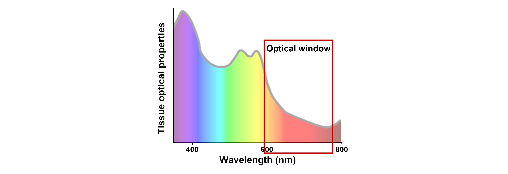
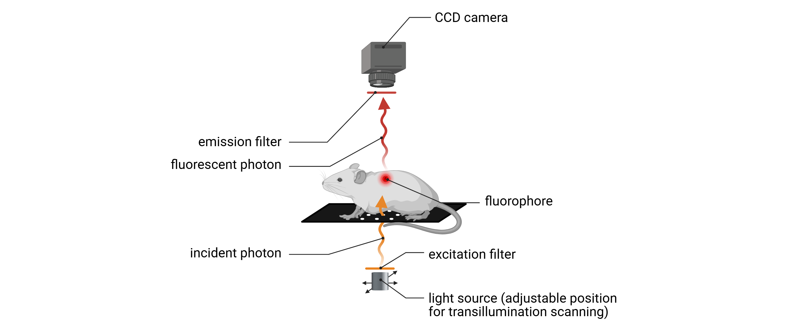

In vivo Optical Imaging
=======================

Technology overview
-------------------
In vivo optical imaging is a versatile, non-invasive, non-destructive modality that enables the **visualization and quantification**
**of biological processes in living organisms** through the **detection of emitted light** generated from within the biological system.
This approach offers unique advantages for small-animal imaging, including high sensitivity, real-time monitoring, and
longitudinal assessment under physiological conditions.

In the context of preclinical biomedical research, in vivo optical imaging systems have become widely adopted for whole-body
imaging in small animal models such as mice and rats. Operating in the visible to far-red spectral range (450-900nm), these
systems provide an effective balance between spatial resolution, tissue penetration, high sensitivity, and minimal physiological disruption.
Their ability to conduct non-invasive, high-throughput, and longitudinal imaging makes them indispensable tools for **monitoring**
**molecular and physiological events** over time.

Two major emission-based imaging modalities dominate this field: **fluorescence imaging** and **bioluminescence imaging**.

Important considerations
^^^^^^^^^^^^^^^^^^^^^^^^
.. image:: ../_static/light_interaction.png
   :alt: *Visible light interaction with biological matter*
   :width: 1000px
   :align: center

*Visible light interaction with biological matter*

.. raw:: html

Non-invasive in vivo optical imaging provides a powerful platform for monitoring biological processes in live animals.
However, it faces several interrelated challenges, primarily arising from the interactions between visible-range photons
and biological tissues, which can affect imaging performance, spatial accuracy, and data interpretability:

- **Limited tissue penetration**
Both excitation and emission photons are subject to significant absorption and scattering by biological tissues.
This dramatically restricts photon penetration depth, particularly for visible-wavelength fluorophores or reporters,
thereby limiting the modality’s utility for imaging deep anatomical structures. To mitigate this limitation, far-red fluorescent
reporters with high brightness should be prioritized, as far-red signals (650–900 nm) penetrate more deeply into tissues (brain, lung, and liver).

*The optical window for in vivo optical imaging*

.. raw:: html

- **Limited spatial resolution**
Photon scattering in biological tissues limits the spatial resolution of in vivo optical imaging by reducing localization
accuracy, particularly for deep-seated emission sources. The deeper the signal origin, the more pronounced the scattering,
resulting in increased signal blurring and decreased anatomical precision. Bioluminescence imaging avoids autofluorescence
but suffers from low photon output and tissue scattering, which contribute to low spatial resolution and reduced signal localization accuracy.

- **Autofluorescence and background noise**
Endogenous tissue autofluorescence, primarily from skin, fur, and diet, reduces signal-to-noise ratios in fluorescence imaging.

- **Quantitative limitations**
Signal intensity is influenced by reporter brightness, depth, biological variability, and animal positioning, making
fluorescence and bioluminescence data semi-quantitative unless normalized with appropriate controls.

- **Substrate and probe delivery issues**
Bioluminescence imaging requires substrate administration (D-luciferin), and signal intensity is influenced by
delivery efficiency, biodistribution, metabolism, and perfusion. Moreover, because luciferase activity is dependent on
intracellular ATP and oxygen, the signal is sensitive to hypoxic or necrotic environments, potentially leading to variability
across tissues or in disease states. Similarly, fluorescent probes may suffer from non-specific distribution, poor bioavailability,
or off-target accumulation, all of which can compromise signal specificity. Optical signal propagation is further influenced by
tissue pigmentation, vascularization, and hydration.

- **Restricted multiplexing (bioluminescence)**
While fluorescence imaging supports multiplexing through spectral unmixing, enabled by the wide availability of spectrally
distinct reporters, bioluminescence imaging is limited by overlapping emission spectra and shared substrate requirements,
which constrain the ability to perform simultaneous multi-reporter imaging.

Fluorescence imaging
--------------------
Fluorescence imaging relies on the use of fluorophores (synthetic dyes, nanoparticles, or genetically encoded fluorescent
proteins) which are molecules capable of emitting light upon the absorption of photons at specific excitation wavelengths.
These fluorophores absorb light at a defined excitation wavelength and subsequently emit light at a longer wavelength due
to energy dissipation.

*Principle of fluorescence*

.. raw:: html

In in vivo imaging systems, excitation light is typically delivered using spectrally filtered light-emitting diodes (LEDs),
(AMI HT system), or via broadband white-light sources combined with excitation filters (IVIS Spectrum).
These illumination strategies enable selective excitation of fluorophores at their optimal wavelengths, enhancing specificity
and minimizing off-target activation. The resulting fluorescent photons are captured by highly sensitive CCD cameras
after passing through wavelength-specific emission filters, which selectively isolate the desired signal. This approach,
employing narrow-band excitation and emission wavelengths, effectively minimizes background noise originating
from tissue autofluorescence and reduces spectral overlap between multiple fluorophores.

.. image:: ../_static/epi-illumination.png
   :alt: *2D in vivo fluorescence imaging: epi-illumination*
   :width: 1000px
   :align: center

*2D in vivo fluorescence imaging: epi-illumination*

.. raw:: html

This modality enables the targeted visualization of specific biological structures or molecular events through the use of
fluorophores conjugated to targeting moieties such as antibodies, peptides, or receptor ligands. The use of **far-red fluorophores**,
typically within the 650–900 nm spectral range, enhances imaging performance by increasing tissue penetration and reducing
signal interference from endogenous tissue autofluorescence.

Traditionally, in vivo fluorescence imaging employs a **surface-based illumination** strategy, known as an **epi-illumination**
**configuration**, in which both excitation and emission light paths originate from the same side of the animal (typically from the top).
While this setup is effective for detecting superficial signals, it offers limited sensitivity to fluorophores located deeper within
tissue. In contrast, some in vivo optical imaging systems implement a **transillumination-based configuration**, where
excitation light is delivered from the side opposite the detector. As the excitation light propagates upward through the tissue,
it is absorbed by fluorophores that emit photons detectable at the surface. This alternative approach improves sensitivity to deeper
tissue signals and enhances contrast and detection accuracy in 2D fluorescence imaging applications.

Advanced techniques for in vivo fluorescence imaging
^^^^^^^^^^^^^^^^^^^^^^^^^^^^^^^^^^^^^^^^^^^^^^^^^^^^

Spectral unmixing
"""""""""""""""""
Spectral unmixing is an advanced analytical technique used in fluorescence imaging to **separate overlapping fluorescence signals**
in vivo. It enables the discrimination of signals originating from multiple fluorophores within the same imaging field,
or the isolation of specific reporter signals from endogenous tissue autofluorescence. This capability is particularly
critical in **multiplex imaging**, where several fluorescent reporters with distinct (but often partially overlapping) spectral profiles
are used simultaneously to monitor different biological processes. However, spectral unmixing is also highly
beneficial in single-reporter (singleplex) studies, where it can **significantly improve the signal-to-noise ratio** (SNR) by
reducing background fluorescence.

It is important to recognize that the fluorescent signal detected by the camera is a **composite of both specific and non-specific fluorescence**.
It includes photons emitted by the reporter of interest, as well as contributions from endogenous fluorophores (collagen, NADH, and elastin...),
which contribute to tissue autofluorescence. Since the detector integrates all photons indiscriminately, **multi-spectral acquisition**
is required to capture a broader spectral signature that enables the separation of these signals.
Furthermore, both autofluorescence and exogenous fluorescent reporters exhibit **distinctive, wavelength-dependent excitation and emission spectra**.
Although these spectra are characteristic of each fluorophore, they often partially overlap, necessitating the use of
**multiple excitation and/or emission filters** to sample distinct spectral bands. This process forms the basis for accurate **spectral deconvolution**.
In this workflow, the system acquires a **multi-spectral image dataset**, where each image corresponds to a defined
excitation–emission wavelength combination. This generates a **spectral profile** for each pixel, reflecting the combined
contributions of all fluorescent and background sources present in the tissue.

To resolve these mixed signals, spectral unmixing algorithms are applied. These algorithms mathematically deconvolve the
composite fluorescence spectrum using a set of reference spectra, typically derived from **reporter-negative control** animals
(for background subtraction) and **single-reporter controls** or well-characterized standards (for signal identification).
By fitting the measured spectra to these reference fingerprints, the algorithm estimates the **relative contribution of each fluorophore**
at every pixel or region of interest.

The result is a series of unmixed fluorescence images, each depicting the spatial distribution of a specific fluorophore,
even in regions where spectral overlap occurs. This process enables high-specificity localization and semi-quantitative
measurement of fluorescent signals in complex biological tissues, supporting robust in vivo imaging across both multiplex
and single-target applications.

Fluorescence Imaging Tomography (FLIT)
""""""""""""""""""""""""""""""""""""""

*3D in vivo Fluorescence Imaging Tomography: trans-illumination*

.. raw:: html

Three-dimensional (3D) fluorescence imaging tomography (FLIT) is a mesoscopic in vivo imaging technique that enables the
**volumetric localization and semi-quantitative assessment of fluorescent probes** within live small animal models. This
method is based on **transillumination scanning**, where excitation light is delivered from multiple positions beneath the
subject, while fluorescence emission is detected from above using a sensitive CCD camera.
During acquisition, a **series of 2D excitation and fluorescence images **are captured from **multiple illumination positions**
underneath the imaging platform. While the excitation source is systematically repositioned, the detection geometry remains fixed.
These **multiple excitation–emission pairings** allow the system to sample the optical properties across the full volume
of interest. Prior to data collection, a **structured light scan** is performed to acquire the animal’s **surface topography**,
which provides a 3D anatomical reference for reconstruction.

To estimate fluorophore distribution, FLIT integrates the **transmitted excitation light images**, the **fluorescence emission images**
together with the **3D topographic data**. These inputs are processed using a **diffusion-based photon propagation model**,
which simulates light transport through scattering and absorbing tissues. The algorithm estimates both local excitation
fluence (the photon density per unit area at each location) and emission propagation to the detector. The **inverse problem**
is then solved to reconstruct the **3D spatial origin of the fluorescent signal**, resulting in a **semi-quantitative fluorescence**
**map of fluorophore concentration and depth**.

Importantly, FLIT assumes the tissue is homogeneous, treating the imaging volume as a uniformly scattering and absorbing
medium. This simplification enables computationally efficient reconstructions but does not account for tissue heterogeneity
(such as differences between organs like lung, liver, and muscle). As a result, while FLIT provides meaningful volumetric imaging,
it lacks the anatomical precision of more advanced modeling approaches used in dedicated fluorescence molecular tomography
(FMT) systems, which incorporate point-source laser scanning and finite-element or Monte Carlo light modeling
for greater spatial accuracy and quantitative reliability.
Despite these limitations, FLIT offers a robust, high-throughput, and non-invasive solution for 3D in vivo
fluorescence imaging, making it particularly well-suited for longitudinal studies of tumor progression, biodistribution,
and molecular tracking in preclinical models.

Fluorescence tomography with transillumination scanning significantly enhances sensitivity to deep-tissue signals and
enables non-invasive, quantitative imaging of biological processes over time. Despite its limited throughput and longer
acquisition time, this method is particularly well-suited for longitudinal studies involving orthotopic tumor progression
in deep tissues, drug biodistribution, and cellular or molecular tracking in preclinical research settings.

Advantages of fluorescence imaging
^^^^^^^^^^^^^^^^^^^^^^^^^^^^^^^^^^
- **Multiplexing capability**
Fluorescence imaging supports the simultaneous detection of multiple fluorophores through **spectral separation and unmixing**
**algorithms**. This enables the tracking of several molecular targets or cell populations within the same animal.

- **Great flexibility in probe design and availability**
A wide variety of fluorescent probes is available, differing in excitation/emission wavelengths and reporter brightness.
This allows for tailored selection based on imaging depth, tissue penetration, and target specificity. An excellent resource
for spectral properties and compatibility is FPbase, https://www.fpbase.org/ an open-access, community-curated database.

- **Strong signal intensity and high throughput for longitudinal imaging**
Fluorescent probes generate strong and stable signals under optimized excitation, allowing for faster image acquisition
compared to bioluminescence. This supports higher throughput and makes fluorescence imaging well-suited for longitudinal studies.

- **High spatial resolution**
Fluorescence imaging generally provides higher spatial resolution in 2D planar imaging, particularly for superficial signals,
due to focused excitation and stronger photon yield.

- **Short imaging time and streamlined workflow**
Fluorescence imaging allows for rapid acquisition without the need for substrate injection or distribution delays. This
enables short setup and imaging times, facilitates high-throughput studies, and reduces variability across imaging sessions,
enhancing reproducibility.

- **Compatibility with multimodal and cross-scale imaging**
Fluorescent reporters can be used across multiple imaging platforms, including intravital microscopy and postmortem techniques such as IHC,
confocal microscopy and light-sheet microscopy, providing continuity from mesoscopic to microscopic resolution.

Limitations of fluorescence imaging
^^^^^^^^^^^^^^^^^^^^^^^^^^^^^^^^^^^
- **High background signal**
Fluorescence imaging is affected by endogenous tissue autofluorescence—particularly from skin, fur, and food, which drastically reduces
signal-to-noise ratio, especially in the visible spectral range.

- **Limited depth penetration**
Excitation and emission light in fluorescence imaging are both subject to strong scattering and absorption, limiting
signal detection from deeper anatomical regions compared to bioluminescence.

- **Low specificity**
The use of an external excitation light source can result in off-target activation and non-specific fluorescence, as well
as increased background due to autofluorescence, reducing the specificity of the detected signal.

- **Low sensitivity**
Due to background interference and light attenuation, fluorescence imaging is generally less sensitive than bioluminescence
for detecting low-abundance targets or weak signals.

- **Complex quantification**
Fluorescence intensity is influenced by excitation light distribution, tissue optical properties, and probe concentration,
making quantitative analysis more challenging. Accurate quantification requires careful normalization, background subtraction,
and appropriate controls to isolate specific reporter signals.

Bioluminescence imaging
-----------------------
Bioluminescence imaging is a highly sensitive, non-invasive imaging modality that relies on the detection of light produced
by **enzymatic reactions** within living organisms. In this process, genetically encoded enzymes known as luciferases catalyze
the oxidation of small-molecule substrates (D-luciferin, coelenterazine) in the presence of ATP and oxygen, leading to the
emission of visible photons.

.. image:: ../_static/bioluminescence.png
   :alt: *Principle of bioluminescence*
   :width: 1000px
   :align: center

*Principle of bioluminescence*

.. raw:: html

In in vivo bioluminescence imaging systems, the substrate (D-luciferin) is systemically administered, typically via intraperitoneal
or intravenous injection, prior to image acquisition. Once distributed to target tissues, the substrate is locally oxidized by
luciferase-expressing cells, producing visible photons through an enzymatic reaction that requires ATP and oxygen.
This light then diffuses through surrounding tissues and is captured by a cooled, high-sensitivity CCD camera positioned
above the animal. Because bioluminescence produces inherently low photon output, cooled CCD detectors are essential to
reduce electronic noise and enable detection of weak signals. Unlike fluorescence imaging, bioluminescence imaging does
not require external excitation or spectral separation; as a result, optical filters are typically not required, and
total photon emission can be collected directly across the full spectrum.

*2D in vivo bioluminescence imaging*

.. raw:: html

Bioluminescence imaging systems generally operate in a planar 2D acquisition mode, in which signal is integrated over
the surface of the animal. The resulting images reflect the spatial distribution and magnitude of reporter gene expression
or cell localization.

Advanced techniques for in vivo bioluminescence imaging
^^^^^^^^^^^^^^^^^^^^^^^^^^^^^^^^^^^^^^^^^^^^^^^^^^^^^^^

Diffuse Light Imaging Tomography (DLIT)
"""""""""""""""""""""""""""""""""""""""

*3D in vivo Diffuse Light Imaging Tomography*

.. raw:: html

Diffuse Light Imaging Tomography (DLIT) is a three-dimensional (3D) in vivo imaging technique designed to estimate the
**volumetric distribution of bioluminescent sources** in small animal models. DLIT expands upon conventional 2D bioluminescence
imaging by integrating **surface topography mapping** and **multi-spectral photon detection**, enabling the **tomographic**
**reconstruction of light sources** within scattering tissues.

In DLIT, the bioluminescent signal is acquired at **multiple emission wavelengths**, typically using a set of broadband spectral
filters. Because the emission spectrum of the bioluminescent reporter is known, multi-spectral acquisition allows for
**modeling how light of different wavelengths is scattered and absorbed by tissue**, which provides information critical
for **estimating both the depth and location of the signal**. Before acquisition, a structured light scan is used to
generate a **3D surface map of the animal**, which serves as the anatomical frame for photon propagation modeling.
The reconstruction algorithm applies a **diffusion-based photon propagation model** to simulate how light travels from
internal sources through scattering and absorbing tissue. By solving the inverse problem using surface photon data,
the system estimates the 3D spatial origin and intensity of the bioluminescent signal. However, because bioluminescence
is isotropically emitted (in all directions), the precision of depth localization is inherently lower than in FLIT, where
directionally controlled excitation improves reconstruction accuracy.

As a result, this approach enables depth localization of luciferase-expressing cells or regions, semi-quantitative three-dimensional
mapping of signal intensity, and improved discrimination of overlapping signals in adjacent anatomical compartments.

Although DLIT retains the high sensitivity and specificity of planar bioluminescence imaging, it adds valuable spatial
context, enhancing biological interpretation—particularly in applications such as orthotopic tumor models, inflammation,
and tissue-specific gene expression studies.

Advantages of bioluminescence imaging
^^^^^^^^^^^^^^^^^^^^^^^^^^^^^^^^^^^^^
- **Exceptional sensitivity and low background**
Bioluminescence imaging generates light through enzyme-catalyzed reactions (luciferase and substrate), producing signal
only where the reporter is expressed. Since mammalian tissues do not express endogenous luciferase-type enzymes, there
is no intrinsic background signal. Combined with the absence of external excitation light, and therefore no tissue autofluorescence,
this results in an exceptionally high signal-to-noise ratio, enabling detection of even low-abundance targets.

- **High specificity**
Signal is confined to regions where both luciferase expression and substrate presence overlap, providing strong spatial
specificity for monitoring gene expression, cell viability, or promoter activity.

- **Quantitative potential**
Under controlled conditions (consistent substrate delivery and oxygenation), bioluminescence signal intensity can reflect
cell number, reporter gene expression, or tumor burden in a highly linear and quantitative manner.

- **No autofluorescence or photobleaching**
The absence of excitation light eliminates tissue autofluorescence, photobleaching, and phototoxicity, allowing for repeated
longitudinal imaging with minimal biological disruption.

- **Enhanced deep-tissue sensitivity**
Many luciferase systems emit light in the red to near-infrared range, which penetrates tissue more effectively than shorter-wavelength
fluorescence. Combined with low background, this allows for better detection of signals from deep anatomical sites.

- **Total photon detection**
Because bioluminescence does not require excitation, all emitted photons can be collected without spectral filtering,
maximizing detection sensitivity and simplifying optical configuration.

- **Simplified signal analysis**
Bioluminescence imaging produces background-free signals without the need for excitation light, autofluorescence correction,
or spectral unmixing. This allows for cleaner data interpretation and more straightforward quantification, especially in single-reporter studies.

- **Well suited for systemic imaging**
Bioluminescence is ideal for tracking systemically distributed processes, such as metastasis, immune cell trafficking,
infection, or gene expression across the entire organism.

Limitations of bioluminescence imaging
^^^^^^^^^^^^^^^^^^^^^^^^^^^^^^^^^^^^^^
- **Low spatial resolution**
Bioluminescent photons are emitted isotropically and often originate from deeper tissues. As they scatter through biological
structures, the resulting signal becomes diffuse and blurred, reducing spatial resolution, particularly in 2D imaging.

- **Dependence on substrate delivery and biodistribution**
Bioluminescence imaging requires systemic administration of a substrate, and signal intensity depends on substrate availability,
biodistribution, and tissue uptake. These factors can vary not only between animals but also with pathological conditions (tumors,
necrosis, or inflammation) which may alter vascularization, perfusion, and metabolic clearance. This leads to both inter-individual
and intra-individual variability, especially as disease states evolve over time.

- **Requirement for pilot studies to define imaging conditions**
A pilot study is typically required to characterize substrate kinetics, including the time to signal plateau, signal duration,
and the optimal imaging window. This ensures consistent quantification across time points and subjects, and helps account
for variability in substrate uptake and signal dynamics.

- **ATP and oxygen dependence**
Luciferase activity requires intracellular ATP and oxygen, making signal strength sensitive to cell viability and metabolic
state. These factors can vary significantly across disease states, such as in tumors, ischemic tissues, or inflammatory sites,
potentially leading to reduced or inconsistent signal unrelated to reporter expression.

- **Longer experimentation and acquisition time**
Bioluminescence imaging typically requires longer exposure times (seconds to minutes) due to lower photon yield, increasing
the risk of motion artifacts and limiting high-speed imaging. Additionally, there is a delay between substrate injection
and signal acquisition, as time is needed for the substrate to circulate, distribute, and reach the target tissue, further
extending total imaging duration.

- **Limited multiplexing**
Bioluminescent reporters have broad and overlapping emission spectra, and many share the same substrate. This makes simultaneous
multi-reporter imaging technically challenging and often requires sequential imaging or spectral separation strategies.

- **Substrate cost and handling requirements**
Substrates such as D-luciferin or coelenterazine are relatively expensive, require careful preparation and storage, and
may degrade or vary between batches, adding to logistical complexity and experimental variability.

- **Expensive hardware requirements**
Due to the extremely low photon output of bioluminescent signals, imaging systems must use high-sensitivity, cooled CCD
cameras to detect signal reliably. This increases equipment cost compared to basic fluorescent systems.

Comparison of in vivo fluorescence and bioluminescence imaging
--------------------------------------------------------------

*Comparison of in vivo fluorescence and bioluminescence imaging*

.. raw:: html

Best practices for optimizing in vivo optical imaging
-----------------------------------------------------

Imaging preparation
^^^^^^^^^^^^^^^^^^^
- **Reduce light absorption by tissue:** Use hairless or albino animals to minimize melanin-associated photon absorption. If using hairy or pigmented strains, fully shave the imaging area before acquisition to reduce photon loss due to melanin and hair scattering. If using chemical depilation, rinse thoroughly to avoid skin irritation that could impact signal
- **Limit tissue autofluorescence:** Feed animals an alfalfa-free (chlorophyll-free) diet for at least 1 week prior to imaging. This minimizes gastrointestinal autofluorescence
- **Standardize physiological conditions:** Use consistent anesthesia protocols and a heated stage to prevent hypothermia, which can affect probe biodistribution and signal intensity
- **Ensure consistent animal positioning:** Position animals in the same orientation across imaging sessions to allow accurate and reproducible ROI placement

Signal acquisition
^^^^^^^^^^^^^^^^^^
- Avoid auto-exposure for raw signal quantification:
    - When working with uncalibrated photon counts, disable auto-exposure
    - Keep all camera settings (exposure time, binning, f/stop) constant for comparability
- Use radiance (bioluminescence) or radiance efficiency (fluorescence) for calibrated, cross-study comparisons:
    - Exposure-independent quantification: Radiance is normalized for exposure time, making it robust to minor variations in acquisition settings
    - Enables cross-animal and group comparisons: Because it accounts for imaging variables, radiance allows for reliable signal comparison between animals, groups, and imaging sessions, even if ROI sizes or exposures differ
    - Improves reproducibility in longitudinal studies: Ideal for tracking biological changes over time in the same subject, since it removes technical bias from repeated measurements
    - Essential for multi-center or multi-operator studies: Radiance allows for standardized data interpretation across labs using same systems, assuming proper calibration

Imaging optimization
^^^^^^^^^^^^^^^^^^^^
- **Start with a pilot experiment:** Define signal kinetics and substrate/probe timing, especially for bioluminescence imaging
- **Avoid imaging during circadian fluctuations:** Image animals at consistent times of day to reduce variability in metabolism and gene expression
- **Allow imaging system warm-up:** Let CCD cameras and optics stabilize thermally for consistent sensitivity and minimal signal drift

Fluorescence-specific tips
^^^^^^^^^^^^^^^^^^^^^^^^^^
- **Use far-red fluorophores:** Prefer fluorophores emitting 650–900 nm for better tissue penetration and reduced autofluorescence
- **Apply spectral unmixing and background subtraction:** Improve signal accuracy and SNR not only in multiplex but also in single-reporter imaging by:
    - Using reporter-negative control animals to characterize tissue autofluorescence
    - Defining background ROIs in non-targeted regions (contralateral tissue) for subtraction
    - Ensuring consistent ROI placement and size across background and target areas
- Ensure proper controls for multiplex imaging:
    - Include single-reporter control animals for each fluorophore to establish accurate spectral fingerprints and avoid cross-channel bleed-through
    - Use contralateral tissue or a background ROI within the same animal as internal reference region to estimate and subtract non-specific signal
    - Use reporter-negative animals imaged with all channels to define baseline autofluorescence across filters

Bioluminescence-specific tips
^^^^^^^^^^^^^^^^^^^^^^^^^^^^^
- Use freshly prepared substrate
- Store luciferin/coelenterazine at -80°C in the dark, and avoid repeated freeze-thaw cycles
- Optimize substrate administration route: Choose IP or IV injection based on timing and biodistribution needs
- Account for metabolic and physiological variability: Luciferase signal depends on ATP and oxygen availability, consider how disease state, perfusion, and tissue viability may affect interpretation

Data quantification
^^^^^^^^^^^^^^^^^^^
- **Define consistent ROIs:** Use anatomical landmarks to apply identical ROI shape and placement across animals and time points
- Use average or total signal appropriately:
    - Use total signal when ROIs vary in size (growing tumors)
    - Use average signal when ROIs are consistent in size/shape, especially in comparative studies
    - Always specify which metric is used to ensure interpretability
- Never quantify signal from saturated ROIs:
    - Saturated signals are clipped, meaning they do not represent true photon flux, and should be excluded from quantitative analysis
    - To prevent saturation: Use a shorter exposure time, increase the f/stop to reduce the aperture and hence reduce the light and reduce binning
- Always keep your signal well within the dynamic range of the detector

Why IVIS Spectrum
-----------------

*Comparison table of the specifications of the main in vivo optical imaging systems*

.. raw:: html

As illustrated in the comparison table, the IVIS Spectrum stands out as the most versatile platform for in vivo optical
imaging. It is equipped with a comprehensive array of excitation and emission filters, enabling detection across the full
spectrum of commonly used bioluminescent and fluorescent reporters, including those emitting in the visible to far-red range.
The system represents the current state-of-the-art in optical imaging technology, being the only platform that integrates
Diffuse Luminescence Imaging Tomography (DLIT), Fluorescence Imaging Tomography (FLIT), and advanced spectral unmixing capabilities.
These features collectively allow for enhanced sensitivity, quantitative accuracy, and the ability to resolve complex multiplexed
signals in living subjects.
