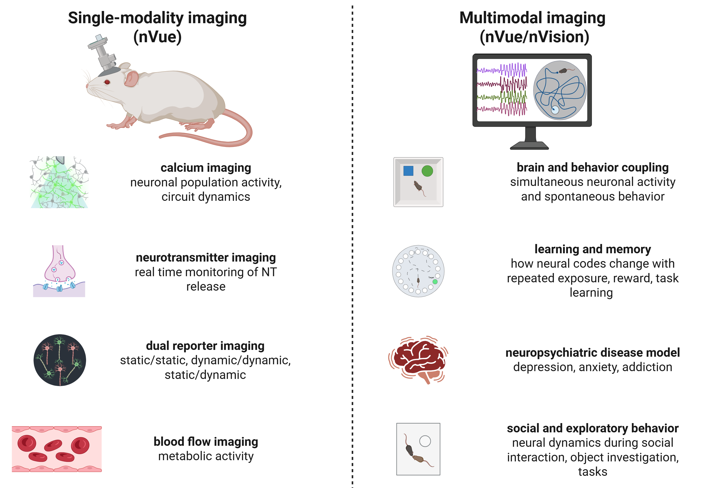

nVue-nVision - Main applications
================================

The nVue miniscope platform is designed to enable **minimally invasive, longitudinal, cellular-resolution imaging** in **freely behaving animals**
paired with **synchronized behavioral tracking**, for **precise spatio-temporal mapping of local brain activity in relation to behavior**.

*Common applications of miniscope imaging*

.. raw:: html

Single modality imaging (nVue)
------------------------------
- **Calcium imaging** (GCamp, RCamp)
    - Enables optical detection of action potential-associated intracellular Ca²⁺ transients.
    - Captures population-level activity from excitatory or inhibitory neurons.
    - Applied in studies of cortical and subcortical circuit function during task performance, rest, or spontaneous activity.
- **Neurotransmitter imaging** (dLight, GRAB, iGluSnFR)
    - Measures extracellular neurotransmitter dynamics such as dopamine, glutamate, serotonin, or acetylcholine in real time.
    - Useful for studying neuromodulatory control of motivation, reinforcement, attention, and emotional state.
    - Applied in pharmacological studies and addiction research.
- **Dual-signal imaging**
    - Simultaneous recording of neural activity and/or neuromodulatory signals using spectrally distinct fluorescent indicators.
    - Allows dissection of causal relationships between neurotransmitter release and downstream circuit responses.
    - Ideal for multi-population or multi-pathway functional mapping within the same brain region.
    - Allows for static/static, static/dynamic and dynamic/dynamic recordings.
- **Longitudinal neural ensemble tracking**
    - Supports stable, chronic recordings from the same neuronal population across days or weeks.
    - Enables investigation of learning-related plasticity, disease progression, and memory consolidation.
    - Facilitates studies of neuronal identity retention, population coding dynamics, and circuit adaptation.
- **Cerebral blood flow imaging**
    - Investigates vascular responses to circuit activation.
    - Studies of neurovascular impairment in aging, stroke, or models of neurodegenerative diseases.
    - Evaluates metabolic load and vascular plasticity in learning or disease contexts.

Multimodal imaging (nVue + nVision)
-----------------------------------
The synchronization of both nVue and nVision cameras enable the real time combination of neuronal signal imaging with behavior.
- **Brain-behavior coupling**
    - Enables real-time correlation between neuronal ensemble dynamics and specific motor, cognitive, or emotional behaviors.
    - Critical for identifying functional neural correlates of decision-making, navigation, or social interaction.
    - Provides high temporal resolution synchronization of neural and behavioral data streams.
- **Learning and memory encoding**
    - Tracks how ensemble activity evolves across repeated exposure to environmental stimuli or operant tasks.
    - Used to reveal circuit-level mechanisms of learning phases (acquisition, consolidation, extinction).
    - Supports causal inference in behavior-driven plasticity through repeated exposure paradigms.
- **Neuropsychiatric and neurological disease models**
    - Enables quantitative phenotyping of circuit dysfunction in models of depression, PTSD, anxiety, addiction, Alzheimer’s, and Parkinson’s disease...
    - Allows evaluation of therapeutic interventions (pharmacologic, genetic) on both behavior and brain function.
    - Ideal for longitudinal biomarker discovery at the level of cellular networks.
- **Social and ethologically relevant behaviors**
    - Permits imaging during unrestrained behaviors such as social investigation, aggression, parental care, or environmental exploration.
    - Supports analysis of circuits involved in emotional valence, threat response, or affiliative behavior.
    - Especially relevant in translational studies of neurodevelopmental or affective disorders.

