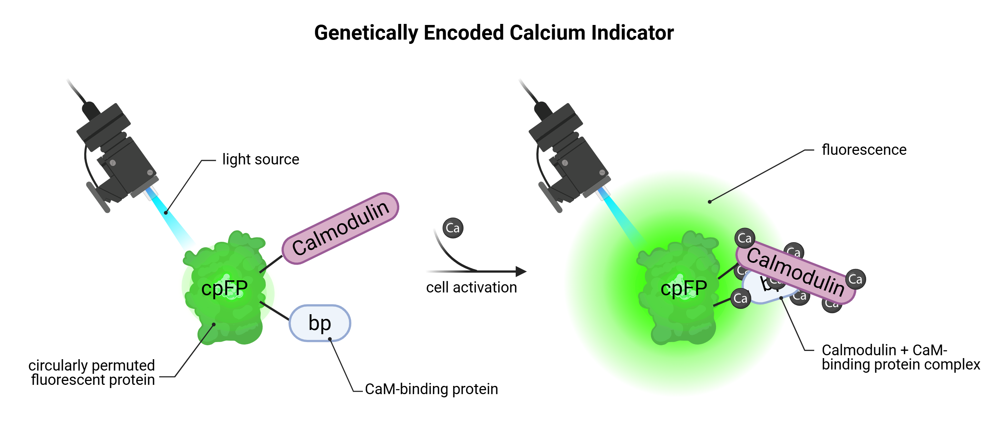
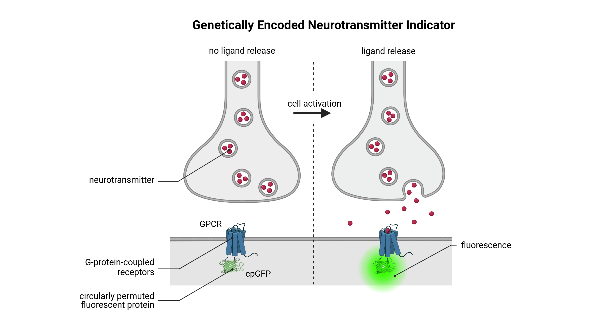
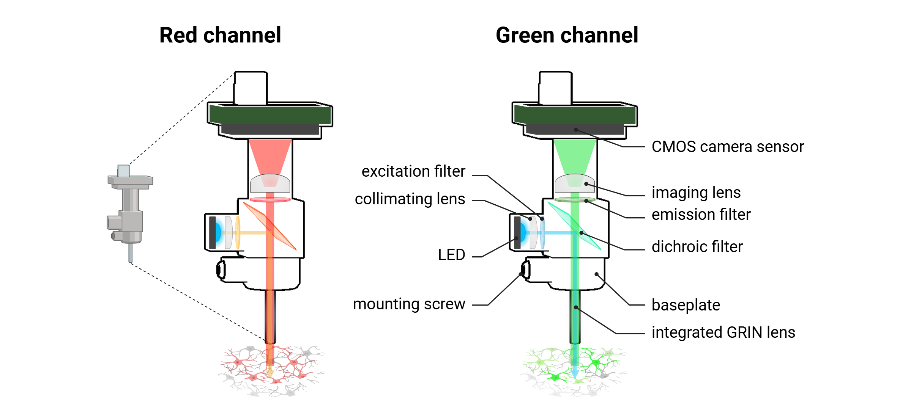
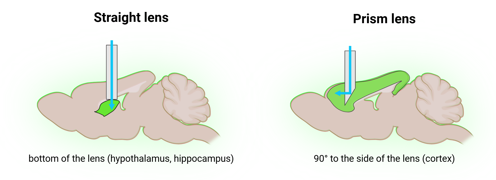
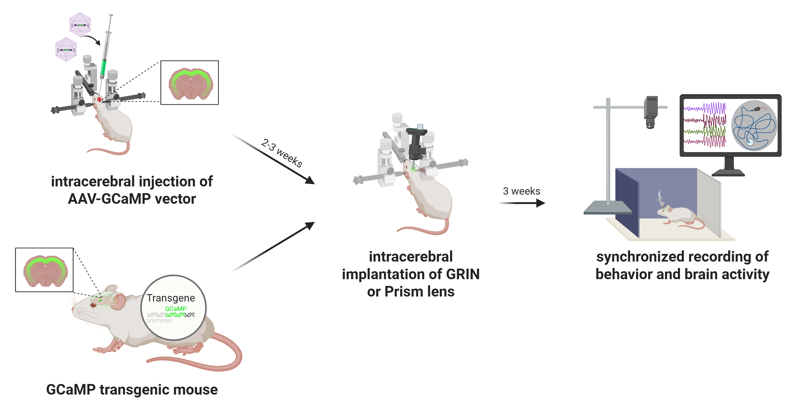

nVue-nVision - Technology overview
==================================

nVue and nVision together form a **high-resolution, multimodal imaging** ecosystem that enables the **real-time visualization**
and **quantification of neural dynamics and behavior** in freely moving animal models. Designed for preclinical neuroscience
research, these platforms operate synergistically to provide a comprehensive, **temporally precise view of brain activity**
and **behavioral outputs**, with millisecond-level resolution and biological relevance across longitudinal studies.

The nVue system is a **miniaturized, dual-color fluorescence microscope (miniscope)** capable of simultaneously recording
optical signals from up to two spectrally distinct genetically encoded indicators. This allows researchers to monitor neuronal
activity via **calcium imaging** using genetically engineered calcium indicators (GCaMP, RCaMP...), **blood flow dynamics**, or
**neurochemical fluctuations** using genetically engineered neurotransmitter indicators (dopamine via dLight or GRAB sensors)
in targeted brain regions. By implanting a GRIN lens into the brain and delivering controlled excitation light through the
miniscope, nVue captures fluorescence signals in real time, enabling minimally invasive, longitudinal
**tracking of circuit-level neural processes in vivo**. It supports both **static imaging** of a specific cell population in a defined
brain areas and **dynamic measurements** of localized physiological activity.

The nVision platform complements nVue by integrating its neural imaging output with high-definition **behavioral tracking**,
real-time experimental control, and environmental modulation. Using DeepLabCut’s AI-enhanced video analysis, nVision enables
synchronized capture of **locomotion, posture, social interactions, and task-specific behaviors**, correlating them precisely
with concurrent neural activity. The platform also supports closed-loop paradigms, where defined neural events can automatically
trigger external stimuli (light, sound, or reward delivery), allowing for causal investigations into **brain-behavior relationships**.

Together, nVue and nVision empower researchers to perform longitudinal, systems-level investigations, bridging the gap
between **molecular signaling, neural circuit function, and complex behaviors**. These tools are particularly advantageous
in fields such as cognitive neuroscience, behavioral pharmacology, and neurological disease modeling, where understanding
the dynamic interplay between neural activity and behavior is critical.

Important considerations
------------------------
Miniature fluorescence microscopy enables high-resolution, real-time imaging of neural activity in freely behaving rodents.
Its effectiveness critically depends on the use of **genetically encoded biosensors**, specifically **genetically encoded calcium indicators** (GECIs)
and **genetically encoded neurotransmitter indicators** (GENIs). These molecular tools transduce intracellular calcium transients
and extracellular neurotransmitter fluctuations, respectively, into fluorescent signals. When expressed in targeted neuronal populations,
they permit **cell-type-specific, spatiotemporally precise visualization of circuit dynamics** underlying behavior, learning, and neuromodulation.

Intracellular calcium biosensors
^^^^^^^^^^^^^^^^^^^^^^^^^^^^^^^^

*Mechanism of Genetically Encoded Calcium Indicators (GECIs)*

.. raw:: html

**Genetically encoded calcium indicators** (GECIs) are **cytoplasmic molecular biosensors** engineered to optically report
**changes in intracellular calcium concentrations** ([Ca²⁺]ᵢ), which serve as reliable and indirect proxies for neuronal activity.
The most extensively used class of GECIs is the **GCaMP family**, which consists of a **circularly permuted green fluorescent protein**
(cpGFP) fused to **calmodulin** (CaM) and a **calmodulin-binding peptide** (M13). During neuronal depolarization, the opening
of voltage-gated calcium channels permits calcium influx. Binding of calcium to calmodulin promotes a conformational rearrangement
that facilitates its interaction with M13, ultimately stabilizing the cpGFP chromophore and resulting in a **pronounced increase in fluorescence intensity**.
This **calcium-dependent fluorescence response** is both rapid and reversible, enabling the real-time monitoring of neuronal
dynamics with high temporal fidelity.
Due to their protein structure, GECIs exhibit **baseline fluorescence** even in the absence of calcium binding, stemming from
the constitutive folding of cpGFP. While this background signal is advantageous for confirming expression and maintaining
optical traceability, it imposes a **limitation on the signal-to-noise ratio**, particularly in circuits with low spiking
frequency or subthreshold activity. Consequently, accurate interpretation of fluorescence traces necessitates rigorous
calibration, thresholding, and often the selection of **high-dynamic-range variants**, such as GCaMP6f or GCaMP7f, which are
specifically optimized for detecting fast, transient signals associated with single or few action potentials.

A diverse portfolio of GCaMP variants has been developed, each offering **distinct kinetic profiles and sensitivity ranges**,
thereby enabling researchers to match the indicator to the demands of the experimental paradigm, from millisecond-resolved
detection of individual spikes to integrated monitoring of population-level oscillations. When expressed under **cell-type-specific**
or **region-specific promoters**, or delivered via viral vectors, GECIs allow for targeted, genetically precise imaging of
neural ensembles.

Altogether, the expanding library of GECI tools, ranging from ultra-fast kinetic sensors to integrative, high-sensitivity
variants, offers unparalleled flexibility for studying brain function. Their use has become foundational in modern systems
neuroscience, particularly for interrogating the spatiotemporal organization of neural circuits during behavior, learning,
memory, and disease states.

Synaptic neurotransmitter biosensors
^^^^^^^^^^^^^^^^^^^^^^^^^^^^^^^^^^^^

*Mechanism of action of Genetically Encoded Neurotransmitter Indicator (GENIs)*

.. raw:: html

**Genetically encoded neurotransmitter indicators** (GENIs) are membrane-localized molecular biosensors engineered to
optically report **fluctuations in extracellular neurotransmitter concentrations**, thereby enabling the real-time detection
of **synaptic transmission and neuromodulatory events** in vivo. These sensors are typically constructed by fusing a
**neurotransmitter-binding domain**, often derived from **modified G protein-coupled receptors** (GPCRs), to a
**circularly permuted fluorescent protein** (commonly cpGFP). Upon ligand binding, the GPCR-derived domain undergoes a
ligand-induced conformational rearrangement, which alters the environment of the cpGFP chromophore and leads to a robust,
reversible **change in fluorescence intensity**. This molecular mechanism enables the transformation of transient chemical signals
into quantifiable optical readouts with high spatial and temporal precision.

GENIs are available for a broad range of neurotransmitters, including dopamine (dLight1, GRAB-DA), glutamate (iGluSnFR),
acetylcholine (GRAB-ACh), serotonin (GRAB-5HT), and others. Their performance is defined by tunable parameters such as ligand
affinity, dynamic range, response kinetics, and photostability, which can be optimized to match specific physiological
release patterns, including **phasic versus tonic signaling**. These indicators are particularly well-suited for monitoring
**neuromodulatory dynamics in targeted brain regions**, offering critical insights into the cellular and circuit-level
mechanisms underlying reward processing, motivation, arousal, learning, and behavioral flexibility.

When delivered via viral vectors and expressed under **cell-type- or projection-specific promoters**, GENIs allow for precise,
**circuit-defined measurement of neurotransmitter signaling** in both local and long-range pathways. Similar to GECIs,
GENIs exhibit a degree of baseline fluorescence in the absence of ligand, attributable to the structural conformation of
the cpGFP domain. While this background signal facilitates monitoring of expression levels and cellular localization,
it necessitates appropriate calibration and normalization to distinguish authentic neurotransmitter-evoked responses from
baseline fluctuations. High-sensitivity variants, such as dLight1.3b and GRAB-DA2m, have been engineered to optimize detection
across physiological concentration ranges, allowing for subsecond resolution of neuromodulatory events during naturalistic behavior.

Comparison of GECI and GENI
^^^^^^^^^^^^^^^^^^^^^^^^^^^

*Comparison of GECIs and GENIs biosensors*

Miniscope imaging
-----------------

Hardware
^^^^^^^^
A miniscope is a **miniaturized epifluorescence microscope** engineered to be compact and lightweight, allowing it to be
mounted onto the head of a freely moving mouse with minimal discomfort or disruption of natural behavior.

*In vivo dual color miniscope imaging*

.. raw:: html

As with conventional fluorescence microscopes, the miniscope includes an **excitation light source**, (high-power LED).
The divergent light emitted from the LED is first directed by a collector lens, which focuses and channels the beam into the optical system.
This incident light is then passed through an **excitation filter**, which spectrally selects the appropriate wavelength required
to excite the targeted fluorescent reporter. The refined excitation light is reflected downward by a **dichroic mirror**,
which is specifically designed to **reflect excitation wavelengths** while transmitting longer-wavelength emitted fluorescence.
The directed excitation light then enters the brain through the objective lens, which in miniscopes is typically a **gradient-index (GRIN) lens**.
This GRIN lens has a radially graded refractive index, allowing it to efficiently focus the excitation light into deep brain structures
while maintaining compact form and **minimal optical aberration**.
Upon excitation, fluorophores expressed in neurons or surrounding tissue emit photons corresponding to their characteristic
emission spectra. These emitted photons travel back through the same GRIN lens and are transmitted through the dichroic mirror,
which now functions as a **pass-through filter** for the emission wavelengths. The fluorescence signal is subsequently passed
through an **emission filter**, which further isolates the desired emission band while eliminating residual excitation light.
Finally, the filtered emission light is directed through an **achromatic imaging lens**, which focuses the signal onto a CMOS
camera sensor positioned at the distal end of the miniscope. This configuration enables the acquisition of a high-resolution,
two-dimensional fluorescence image that reflects the spatial distribution and temporal dynamics of neural activity within
the defined field of view. The achromatic lens corrects for chromatic aberration across the emission spectrum, ensuring
sharp image quality and signal fidelity across different fluorescence channels.
For additional details regarding fluorescence, please refer to the section :ref:`fluorescence-imaging`.

GRIN lens
^^^^^^^^^
**Gradient Index (GRIN) lenses** are optical elements that exploit a **radial gradient in refractive index** to bend light
rays internally rather than at curved surfaces, as in traditional lenses. As a result, GRIN lenses typically feature flat
entry and exit faces and are designed to guide light along a curved path within the lens body. In miniscope imaging systems,
GRIN lenses function as **1:1 relay lenses**, meaning they transmit the image plane along their length **without altering magnification**.
Their primary purpose is to **extend the optical path** into deep brain regions while preserving resolution and contrast.

*GRIN lens geometry*

.. raw:: html

There are two main types of GRIN lenses used in neural imaging, and selection should be based on the target brain structure
and orientation of the neuronal population:

- **Straight GRIN lenses:** These lenses transmit the image directly along the longitudinal axis of the probe. They are ideal for **imaging neuronal layers positioned directly beneath the implanted lens**, and are the most commonly used type in in vivo experiments targeting structures such as the hippocampus, thalamus, striatum, or hypothalamus.
- **Prism GRIN lenses:** These incorporate a **90-degree reflective prism** at the distal tip, enabling **lateral imaging** perpendicular to the insertion axis. This design allows for visualization of **structures that are located adjacent to the probe body**, rather than directly below it. Prism lenses are particularly advantageous for cortical imaging, as they permit **multi-layer field-of-view acquisition** without needing to penetrate vertically through all cortical layers.

Because GRIN lenses are made of precision optical glass, their imaging surfaces must be handled with care. Any scratches,
chips, adhesive residue, or surface contamination can degrade optical performance, introduce aberrations,or obstruct the
field of view. If needed, clean the lens using lens paper moistened with 70% ethanol, applying gentle, circular motions to
avoid damaging the surface. Avoid touching the imaging face with bare tools or gloves, and always cover the lens when not
in use to prevent environmental contamination.

Workflow for in vivo miniscope imaging
^^^^^^^^^^^^^^^^^^^^^^^^^^^^^^^^^^^^^^

*Common workflow for in vivo miniscope imaging with dual color*

.. raw:: html

The successful implementation of miniscope-based imaging in freely behaving animals requires a **multi-stage experimental**
**workflow** that integrates **genetic targeting of fluorescent indicators**, **surgical implantation of a gradient-index (GRIN) lens**,
and **chronic in vivo optical recording**. Each phase must be carefully optimized to ensure high-quality data acquisition
and minimal disruption to animal health or behavior.

Targeted expression of fluorescent biosensors
"""""""""""""""""""""""""""""""""""""""""""""
Miniscope imaging relies on the expression of genetically encoded calcium indicators or neurotransmitter indicators in neurons of interest.
This is typically achieved through one of two strategies:

- **AAV-mediated viral delivery**
Recombinant adeno-associated virus (AAV) vectors are commonly employed to drive the expression of genetically encoded
fluorescent indicators in targeted neuronal populations. The indicator gene is placed under the control of a **cell-type-specific or pan-neuronal promoter**,
such as human synapsin (hSyn) for broad neuronal expression, or CaMKIIα for excitatory neuron selectivity. AAV constructs
are delivered via **stereotaxic injection** into the brain region of interest (hippocampus, striatum, or cortex),  with
precise spatial targeting guided by anatomical landmarks or coordinates derived from a stereotaxic atlas.
The choice of **AAV serotype** (AAV1, AAV5, AAV9) and **viral titer** must be carefully optimized to achieve efficient cellular
transduction while minimizing cytotoxic effects, inflammatory responses, and off-target expression.
Optimization of viral titer, serotype, and targeting parameters is typically validated through **direct visualization of the fluorescent reporter**
in brain tissue. In many cases, when the indicator is expressed at sufficient levels, native fluorescence can be readily
observed using standard fluorescence microscopy in either fresh brain slices or fixed tissue. This approach allows rapid,
non-destructive assessment of expression strength, anatomical accuracy, and spread of transduction, and is especially
useful for high-throughput evaluation across experimental animals.
In addition to native fluorescence imaging, **post-mortem immunohistochemistry** may be employed for enhanced sensitivity
or when expression levels are low. IHC uses antibodies targeting the reporter protein (anti-GFP for GCaMPs) or a co-expressed
fluorescent tag (mCherry, tdTomato), allowing high-resolution evaluation of cell-type specificity, transduction efficiency,
and signal localization. Together, these validation approaches ensure that the chosen AAV construct and delivery parameters
result in optimal, stable biosensor expression prior to GRIN lens implantation and chronic imaging.

Following AAV injection, a **2–4 week expression window** is generally required to allow sufficient indicator production and
functional folding. This period also ensures stabilization of fluorescence intensity and minimizes confounding effects
due to acute viral response or surgical trauma. Only after this maturation window is it advisable to proceed with GRIN lens
implantation and functional imaging using the miniscope platform.

- **Transgenic animal models**
Transgenic mouse lines expressing genetically encoded calcium indicators (Thy1-GCaMP6, TIT2L-GCaMP6f) offer a robust and
reproducible alternative to viral vector-based expression systems. These lines provide **stable, heritable, and cell-type-specific expression**
of calcium indicators under the control of defined promoters, enabling consistent signal intensity and anatomical coverage
across animals and experiments. Importantly, the use of transgenic models eliminates the need for stereotaxic AAV injection,
thereby reducing surgical burden and avoiding potential sources of experimental variability.
Transgenic GCaMP lines are particularly well-suited for long-term, chronic imaging studies, developmental time-course experiments,
and investigations requiring minimal invasiveness or inter-animal variability. These advantages are especially valuable in
behavioral neuroscience, where consistent expression across cohorts is essential for meaningful comparisons. However,
their use is inherently constrained by the available genetic constructs, limiting flexibility in targeting specific cell types,
projection-defined populations, or combinatorial expression strategies. As such, while transgenic lines provide a valuable
platform for standardization and scalability, their application must be weighed against the need for targeted circuit-level
specificity, which is more readily achieved through AAV-mediated delivery in combination with Cre/Flp recombinase systems.

Intracranial implantation of the GRIN lens
""""""""""""""""""""""""""""""""""""""""""
Following the establishment of robust biosensor expression, a **baseplate-integrated GRIN lens** is surgically implanted
under stereotaxic guidance to provide **chronic optical access to the brain region of interest**. The procedure begins with a
craniotomy over the targeted area, using stereotaxic coordinates for precise anatomical targeting. The GRIN lens is then
carefully positioned approximately 150 μm above the fluorescently labeled neuronal population, thereby avoiding mechanical
disruption of active neural tissue while preserving optimal optical coupling. Once in place, the lens and integrated baseplate
are permanently secured to the skull, forming a stable interface for subsequent attachment of the head-mounted miniscope.
Importantly, optimization of GRIN lens implantation requires **post-mortem histological analysis** to verify implantation coordinates,
confirm targeting accuracy, and assess potential tissue disruption. This step is essential for validating anatomical precision
and for interpreting imaging data in the context of localized neural circuits.

Following surgery, animals are allowed to recover for **1–2 weeks** to support wound healing, tissue stabilization, and attenuation
of glial reactivity. This recovery period also allows the optical interface between the lens and brain tissue to equilibrate,
thereby enhancing imaging clarity and ensuring consistency for longitudinal, high-resolution recordings in freely behaving animals.

Miniscope mounting and imaging
""""""""""""""""""""""""""""""
Once the GRIN lens is stably integrated and fluorescent reporter expression has been verified, the **head-mounted miniscope**
is secured to the implanted baseplate to initiate in vivo imaging. Prior to each imaging session, key acquisition parameters
(LED excitation power, sensor gain, and electronic focal depth...) are adjusted using dedicated acquisition software to
optimize the signal-to-noise ratio while minimizing photobleaching and phototoxicity. Imaging is performed while the animal
is awake and freely behaving, either during spontaneous exploration or in structured behavioral paradigms including open
field tests, maze-based navigation, or operant conditioning tasks. Animal behavior is simultaneously recorded using **synchronized**
**video tracking systems**, enabling precise temporal alignment between neural activity and behavioral events.
Fluorescence signals are acquired at frame rates typically ranging **from 20 to 60 Hz for calcium imaging**, depending on
the experimental demands and the kinetic properties of the biosensor used. Both **single-channel** and **dual-channel acquisition**
modes are supported, enabling simultaneous measurement of multiple biological signals, such as neuronal calcium dynamics
and neurotransmitter release, within the same field of view. Imaging sessions can be repeated longitudinally over days to
weeks, allowing for the chronic tracking of identified neuronal populations, investigation of circuit-level plasticity,
and mapping of behaviorally relevant neural activity patterns across a wide range of experimental conditions.

Data analysis
"""""""""""""
Following data acquisition, raw miniscope imaging videos undergo a **structured preprocessing and analysis pipeline** to extract
biologically meaningful neural activity traces. The first step involves **motion correction**, which compensates for brain
movement and animal locomotion using frame-by-frame image registration algorithms that align frames to a common reference.
This step is essential for maintaining **spatial fidelity of fluorescence signals over time**.
After motion correction, the videos are subjected to **spatial cropping and temporal downsampling**, depending on the experimental
needs, followed by **background subtraction** to enhance signal contrast. Next, ROIs (neuronal soma) are identified using
**semi-automated or fully automated cell segmentation algorithms**, including approaches based on **PCA/ICA**, **CNMF-E**
(constrained non-negative matrix factorization), or **machine learning-based classifiers**. These segmented ROIs are then
used to **extract raw fluorescence traces** (F), which are typically **normalized to obtain ΔF/F₀ values**, calculated as
ΔF/F₀ = (F - F₀) / F₀, where F₀ represents the **baseline fluorescence**. This normalization facilitates comparison
across neurons and imaging sessions.
Additional processing steps include **deconvolution** to estimate underlying spike trains, **trace denoising**, and **quality control filtering**
to exclude low-SNR signals or artifactual ROIs. Once individual cell traces are obtained, downstream analyses may include
population dynamics, activity correlations, event-triggered averages, and **behavioral alignment based on timestamp**
**synchronization with external behavioral data** (locomotion, trial events, video-tracked metrics).
These analyses provide critical insight into how neural activity encodes stimuli, behavior, learning, and circuit-level computations over time.