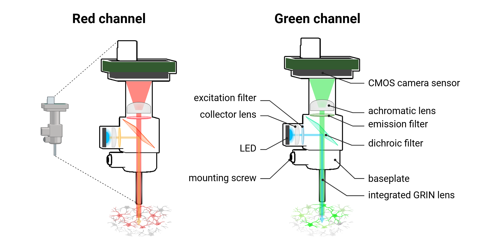

nVue-nVision - Technology overview
==================================

Important considerations
------------------------

Intracellular calcium biosensors
^^^^^^^^^^^^^^^^^^^^^^^^^^^^^^^^
.. image:: ../_static/GECI.png
   :alt: **PMechanism of Genetically Encoded Calcium Indicators*
   :width: 1000px
   :align: center

*Mechanism of Genetically Encoded Calcium Indicators*

.. raw:: html

Intracellular neurotransmitter biosensors
^^^^^^^^^^^^^^^^^^^^^^^^^^^^^^^^^^^^^^^^^

*Mechanism of Genetically Encoded Neurotransmitter Indicators*

.. raw:: html

Workflow
^^^^^^^^
.. image:: ../_static/nVue-workflow.png
   :alt: *Common workflow for in vivo miniscope imaging*
   :width: 1000px
   :align: center

*Common workflow for in vivo miniscope imaging*

.. raw:: html

Hardware
--------

*In vivo miniscope imaging*

.. raw:: html

