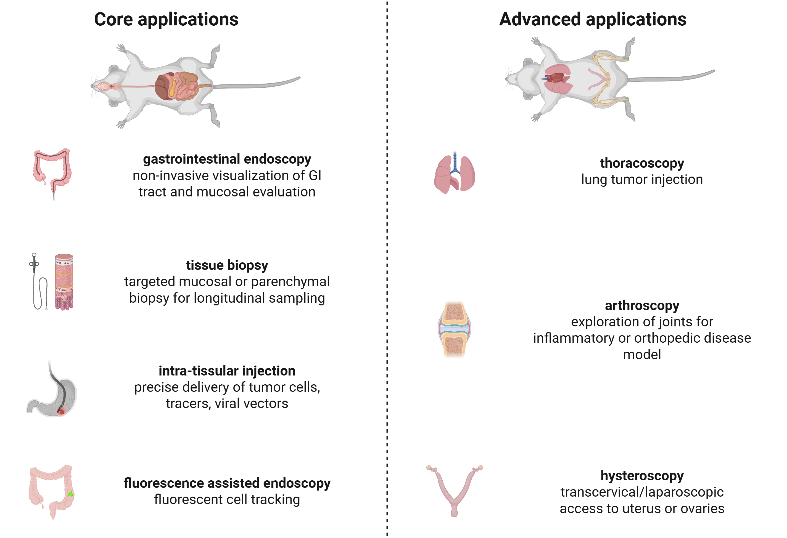

Karl Storz endoscope - Main applications
========================================

The main application of a rodent customized Karl Storrz endoscopic system is **minimally invasive, real-time visualization**
and **intervention within the internal organs** of small animal models. Designed to navigate the compact anatomy of rodents,
these systems enable high-resolution imaging and precision access to **gastrointestinal, thoracic, reproductive, and joint structures**.
Their compatibility with **CO₂ insufflation, irrigation, and advanced light sources** (including far-red fluorescence) makes
them especially valuable for diagnostic procedures, **targeted biopsies**, **intra-tissular drug delivery**, and **longitudinal disease monitoring**.
By reducing surgical trauma and enabling repeated interventions on the same subject, rodent endoscopy supports refined,
ethically sound, and cost-effective preclinical research across a wide range of biomedical fields.

*Common applications of rodent endoscopy*

.. raw:: html

Core applications
-----------------
These applications are regularly implemented using small-diameter rigid or semi-flexible veterinary endoscopes (typically 1.9–3.0 mm
outer diameter), and do not require extreme modifications.

- Gastrointestinal endoscopy
    - Gastroscopy: visualizing esophagus, stomach, and proximal duodenum to study ulcers, tumors, inflammation
    - Colonoscopy: IBD models, tumor tracking, microbiome-gut barrier investigations
- Tissue biopsy
    - Endoscopic-guided mucosal or superficial tissue sampling (intestinal or liver surface biopsies)
    - Minimally invasive and suitable for serial biopsies in the same animal
- Intra-tissular injection
    - Direct delivery of tumor cells, drugs, or fluorescent tracers into specific GI or peritoneal sites under visual guidance
    - Common in orthotopic tumor model creation or targeted delivery experiments
- Endoscopic-assisted fluorescence imaging
    - White light and far-red modes for ICG-based perfusion or lymphatic imaging
    - Confirmation of vascular supply or drug deposition at injection sites

Specialized / Experimental Applications
---------------------------------------
These require custom-built endoscopes, modified surgical techniques, and specialized lab setups. They are rarely routine,
but have been demonstrated in specialized research environments.

- **Thoracoscopy:** direct entry into the thoracic cavity to inspect lungs or heart surface, for lung tumor injection/biopsy orleural delivery of agents
- **Hysteroscopy:** transcervical/laparoscopic access to uterus or ovaries for fertility studies, embryo transfer, or reproductive tumor modeling
- **Arthroscopy:** exploration of small joints for inflammatory or orthopedic disease models

