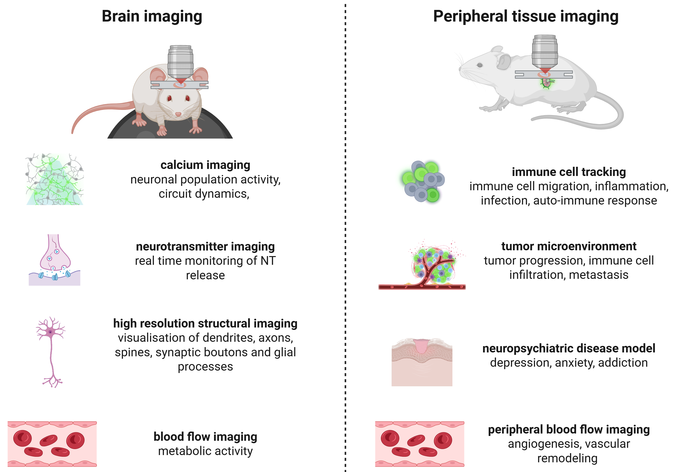

Ultima 2Pplus - Main applications
=================================

The Ultima 2Pplus two-photon microscope is designed to enable **high-resolution, intravital, cellular and subcellular imaging**
in **anesthetized or head-fixed awake animals**, including during controlled sensory stimulation or task performance.
It provides **optical sectioning and deep-tissue imaging** with reduced phototoxicity, allowing precise spatial mapping of
neural, immune, and vascular activity within intact brain and peripheral tissues.

*Common applications of intravital two-photon microscopy*

.. raw:: html

Brain imaging
-------------
- **Calcium imaging** (GCamp, RCamp)
    - Enables optical detection of action potential–associated intracellular Ca²⁺ transients in single neurons and neuronal populations.
    - Supports imaging of excitatory and inhibitory circuits in cortical and subcortical regions during sensory stimulation, behavior, learning, rest, or spontaneous activity.
    - Allows quantification of firing dynamics, population synchrony, and circuit-level coding.
- **Neurotransmitter imaging** (dLight, GRAB, iGluSnFR)
    - Measures extracellular dynamics of neurotransmitters such as dopamine, glutamate, acetylcholine, and serotonin in vivo.
    - Enables direct assessment of neuromodulatory signaling and its relationship to neural activity.
    - Applied in studies of motivation, reinforcement learning, decision-making, attention, and neuropsychiatric disease models.
- **Sequential multi-signal imaging**
    - Allows imaging of multiple fluorescent reporters across sequential acquisitions or experimental sessions using a single excitation laser.
    - Enables comparison of activity across distinct neuronal populations, signaling pathways, or molecular readouts within the same brain region.
    - Suitable for static/static and static/dynamic experimental designs.
- **Longitudinal circuit and ensemble tracking**
    - Supports stable chronic imaging of the same neuronal populations over days to weeks through cranial windows.
    - Enables investigation of learning-induced plasticity, memory consolidation, recovery after injury, and neurodegenerative disease progression.
    - Facilitates analysis of neuronal identity retention and population-level stability or reorganization.
- **Neurovascular and blood flow imaging**
    - Enables visualization of cerebral vasculature, vessel diameter changes, and capillary blood flow using fluorescent tracers.
    - Supports studies of neurovascular coupling, metabolic demand, and vascular dysfunction.
    - Applied in aging, stroke, traumatic brain injury, and neurodegenerative disease research.
- **Structural and synaptic imaging**
    - High-resolution visualization of dendrites, axons, spines, synaptic boutons, and glial processes.
    - Allows correlation of functional activity with structural remodeling and synaptic plasticity.
    - Applied in developmental neuroscience, experience-dependent plasticity, and disease models.

Peripheral tissue imaging
-------------------------
Intravital imaging of peripheral organs and tissues requires direct optical access via implanted or surgically prepared
imaging windows, enabling real-time visualization of cellular dynamics, signaling events, and microenvironmental interactions under physiological conditions.

- **Immune cell tracking and interaction analysis**
    - Visualizes immune cell migration, arrest, and cell–cell interactions in tissues such as skin, lymph nodes, lung, liver, and intestine.
    - Enables investigation of immune surveillance, inflammation, infection, and autoimmune responses.
    - Supports longitudinal tracking of immune behavior during disease progression or therapeutic intervention.
- **Tumor and tumor microenvironment imaging**
    - Enables high-resolution imaging of cancer cells, stromal components, and immune infiltrates in vivo.
    - Allows analysis of tumor cell invasion, metastasis, and cell–cell interactions within the tumor microenvironment.
    - Applied in preclinical oncology and therapeutic response studies.
- **Metabolic and biosensor imaging**
    - Supports imaging of genetically encoded or dye-based biosensors reporting on metabolism, redox state, ion concentration, or intracellular signaling pathways.
    - Enables investigation of tissue stress, metabolic heterogeneity, and signaling dynamics in health and disease.
- **Tissue remodeling and regeneration**
    - Enables longitudinal imaging of cell migration, extracellular matrix remodeling, and tissue repair processes.
    - Applied in regenerative medicine, fibrosis, chronic inflammation, and aging research.
- **Microvascular and blood flow imaging**
    - Visualizes capillary perfusion, leukocyte trafficking, angiogenesis, and vascular remodeling in peripheral organs.
    - Enables studies of ischemia, inflammation, wound healing, and vascular pathology.
    - Supports assessment of tissue perfusion and vascular responses to pharmacological or genetic manipulation.