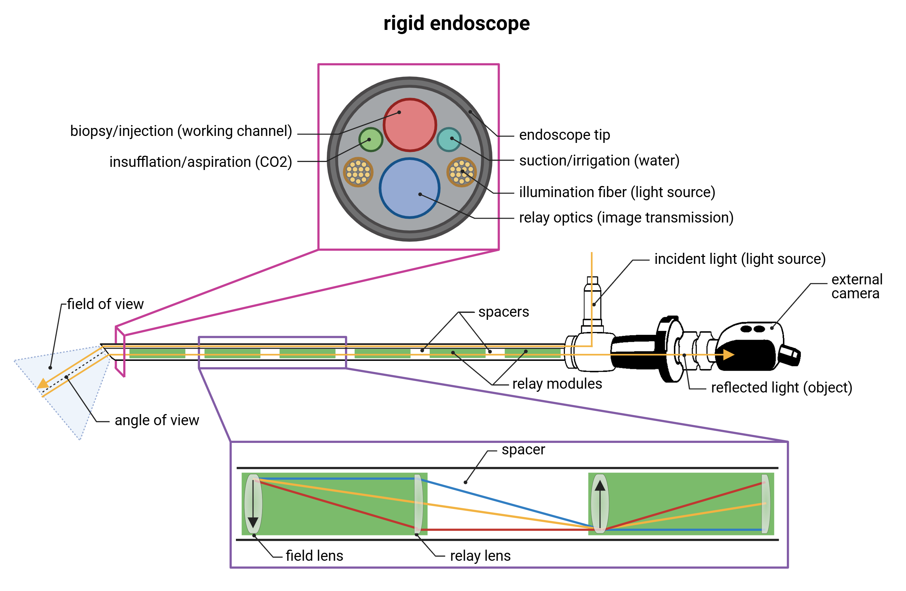
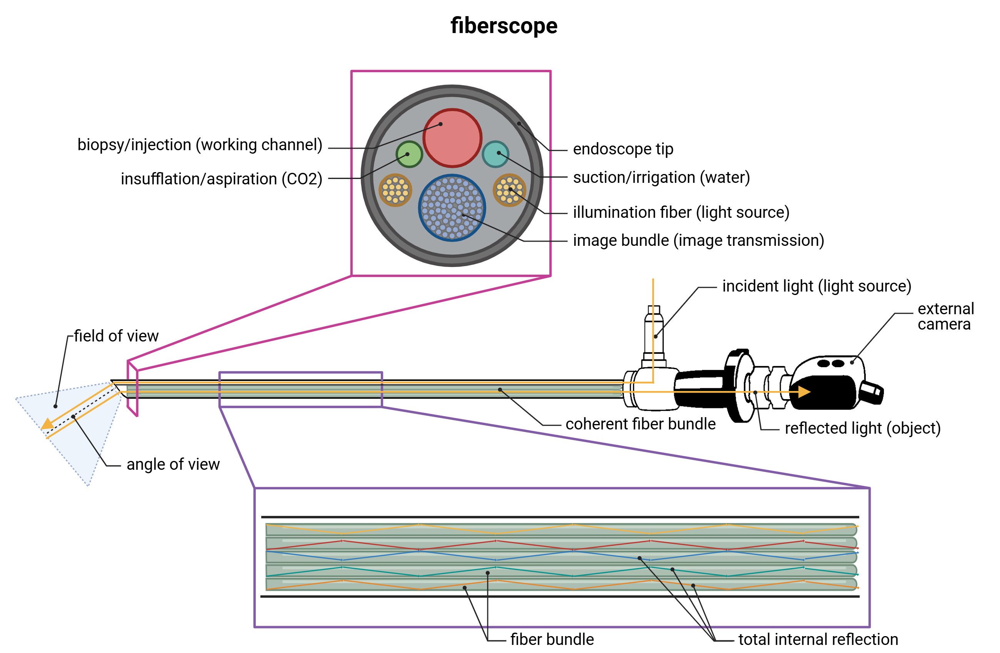

Karl Storz endoscope - Technology overview
==========================================

Rodent endoscopy is a minimally invasive imaging and intervention technique that enables **in situ anatomical visualization of internal structures**
in small animal models. By directly accessing body cavities and hollow organs using **ultra-miniaturized endoscopic optics**,
this modality provides researchers with **real-time, high-resolution views of tissue morphology and physiological processes under native conditions**.
Rodent endoscopy stands apart from external imaging technologies by delivering **true anatomical insight at the site of interest**,
whether within the gastrointestinal tract, peritoneal cavity, or reproductive system. Through the use of specialized endoscopes
with working channels and integrated light sources, including those compatible with fluorescence imaging, researchers can
perform **targeted biopsies**, **localized injections**, and **live tissue monitoring**, all while preserving animal viability for longitudinal studies.

Optimized for the constraints of rodent anatomy, these systems allow for the **dynamic assessment of organ function, pathological progression**,
and **surgical outcomes** without the need for destructive sampling. The ability to observe and manipulate tissues in situ
makes rodent endoscopy an invaluable tool in fields ranging from oncology and immunology to gastroenterology and reproductive biology.
By combining anatomical precision, real-time feedback, and minimal physiological disruption, rodent endoscopy enhances
the fidelity and efficiency of preclinical research, supporting high-throughput, ethically responsible, and
translationally relevant experimental designs.

Important considerations
------------------------
Selecting the **right type of endoscope** is critical for the success of preclinical imaging and intervention in small animals.
The scope's diameter, rigidity, flexibility, and presence of working channels must align with the anatomical site, species,
and procedural goal. Inadequate selection can lead to poor image quality, limited access, or unnecessary tissue trauma,
compromising both data quality and animal welfare. Choosing an appropriately sized and configured endoscope ensures precise
visualization, effective tool deployment, and the ability to conduct minimally invasive, repeatable procedures.

Endoscopy
---------

Rigid endoscope
^^^^^^^^^^^^^^^
The principle of a rigid endoscope is based on the use of a **straight, rod-lens optical system** enclosed in a solid,
cylindrical metal tube. This design allows for the transmission of light and image along a **fixed path with high optical**
**clarity and minimal distortion**, making it ideal for close-range, high-resolution imaging of internal structures.

*Rigid endoscope hardware*

.. raw:: html

Rigid endoscopy relies on a robust optical and mechanical design to facilitate high-resolution, real-time visualization
of internal anatomical structures. A **powerful external white light source**, typically LED or xenon-based, is transmitted
into the body through **fiber-optic light bundles** embedded along the periphery of the endoscope shaft. These bundles ensure
uniform and intense illumination of the target tissue, which is critical for optimal image contrast and color fidelity.
At the distal tip of the scope, a **miniaturized objective lens** collects the reflected light from the illuminated tissue.
This optical information is transmitted proximally through a **rod-lens system**, a series of precisely aligned glass rods and relay
lenses arranged in a linear configuration, which maintains image clarity and orientation with minimal distortion. At the
proximal end, the image can be viewed directly through an **eyepiece** or coupled to a **digital camera system**, enabling
real-time display and recording on external monitors. Some rigid endoscopes are also equipped with instrumentation channels,
allowing for the introduction of biopsy forceps, micro-needles, or other interventional tools under direct visual guidance.

Fiberscope
^^^^^^^^^^
The principle of a fiberscope is based on the use of a **flexible fiber-optic bundle system** enclosed within a narrow,
bendable sheath. Unlike rigid endoscopes, fiberscopes rely on thousands of optical fibers arranged coherently to transmit
the image from the distal tip to the proximal viewing end. Each fiber functions as an independent light conduit, preserving a portion of the visual field.

*Fiberscope hardware*

.. raw:: html

Flexible endoscopy using a fiberscope is based on the use of a highly maneuverable optical system that employs **coherently arranged fiber-optic bundles**
housed within a flexible, tubular sheath. A **powerful external white light source** delivers illumination through **dedicated illumination fibers**
positioned around the periphery of the shaft. These fibers transmit light efficiently to the distal tip, where the target
tissue is illuminated. The image is captured by a **miniaturized lens system **at the distal end and transmitted back to
the **eyepiece** or **imaging processor** through a **central bundle of coherent optical fibers**, each of which conveys
a single “pixel” of the visual field. Unlike rigid scopes that use rod-lens systems, fiberscopes rely on the **coherent spatial**
**arrangement of thousands of optical fibers**, preserving image orientation even as the scope bends. While this configuration
allows navigation through curved or anatomically complex pathways, such as those found in the upper airway, GI tract, or reproductive canals,
it typically results in lower resolution and brightness compared to rigid optics due to fiber cross-talk and limited light throughput.
As a result, the reconstructed image often displays a **honeycomb pattern**, a **visual artifact** arising from the discrete nature
of the fiber cores, which is a hallmark of optical fiber-based imaging. The image is typically viewed via an eyepiece or digitized through a integrated
camera system. Some fiberscopes also incorporate working channels to accommodate micro-instruments, enabling guided biopsies,
fluid aspiration, or localized injections in areas otherwise inaccessible by rigid scopes.

Comparison of endoscope types
^^^^^^^^^^^^^^^^^^^^^^^^^^^^^

*Comparison of endoscope types*

.. raw:: html

Advantages of rodent endoscopy
------------------------------
- **Minimally invasive access**
Endoscopy enables visualization and intervention within internal organs without major surgery, reducing trauma and recovery time.

- **In situ anatomical visualization**
This approach provides direct, high-resolution imaging of mucosal surfaces, tissue architecture, and vascular structures under physiological conditions.

- **Real-time monitoring**
It allows immediate feedback during procedures such as biopsy, tumor cell injection, or fluorescence imaging, improving precision and control.

- ** Longitudinal study capability
Procedures can be repeated in the same animal over time, supporting within-subject designs, reducing variability, and improving statistical power.

- **Tool integration**
Working channels integrated into rodent-compatible endoscopes enable the use of miniaturized instruments for precise and targeted interventions.
These channels support the passage of tools for biopsy, injection, suction/irrigation, and CO₂ insufflation, allowing researchers
to perform complex procedures under direct visual control. This facilitates high-precision delivery of therapeutic agents or
cells directly into specific tissues, and supports real-time manipulation of the target environment—all while maintaining
minimal invasiveness and maximizing experimental control.

- **Fluorescence compatibility**
Advanced systems enable NIR-guided imaging for perfusion, lymphatic tracking, or tumor visualization.

Limitations of rodent endoscopy
-------------------------------
- **Size constraints**
Many anatomical targets in rodents (especially mice) are too small for standard endoscopes, limiting access to larger structures (GI tract, abdominal cavity).

- **Limited working space**
The internal cavities of rodents offer restricted maneuvering room, challenging tool manipulation and visualization compared to larger animals.

- **Reduced image quality in flexible scopes**
Fiberscopes, while flexible, typically offer lower resolution and may display a honeycomb pattern, making fine detail assessment difficult.

- **Technical expertise required**
Successful procedures demand precise technique, animal positioning, and anesthesia management, especially for complex access like
thoracoscopy or reproductive tract endoscopy.

- **Limited scope of applications
The range of feasible endoscopic procedures is narrower in rodents due to anatomical and mechanical constraints.