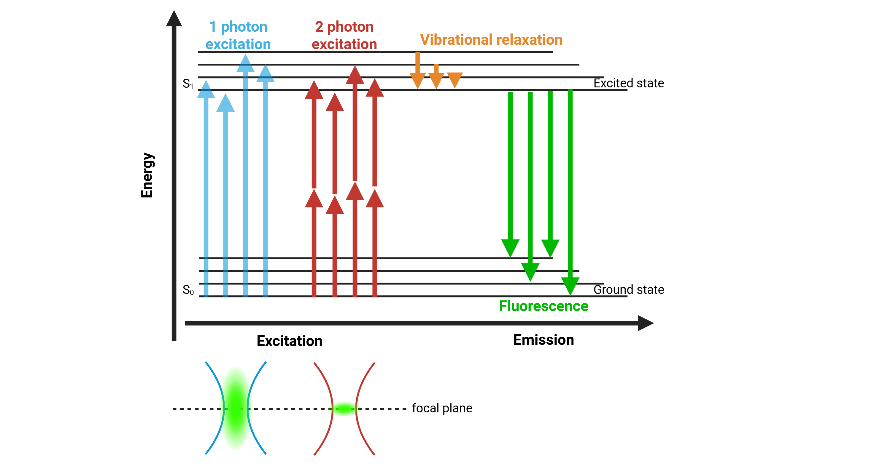
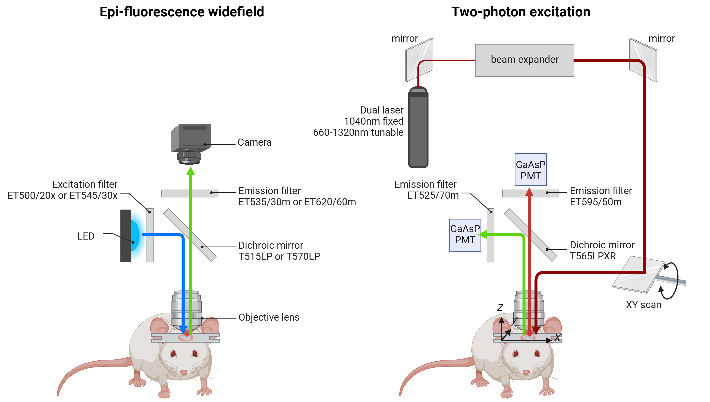

Ultima 2Pplus - Technology overview
===================================

Two-photon microscopy is a powerful, non-invasive imaging modality that enables **high-resolution, deep-tissue visualization**
**and quantification of cellular and subcellular processes** in living rodents. Utilizing **near-infrared femtosecond laser excitation**,
it provides precise imaging at depths of up to 1 mm, making it well-suited for longitudinal studies under physiological conditions.

Ultima 2P Plus is designed for **real-time functional imaging** of the brain, including **calcium dynamics** using genetically
encoded indicators (GCaMP, RCaMP), **neurochemical fluctuations** via fluorescent neurotransmitter sensors (dLight, GRAB),
and **vascular responses** such as blood flow and vessel reactivity. It also supports peripheral imaging using **fluorescent reporter cells**
to study cellular dynamics beyond the central nervous system.

Data acquisition can be performed in **anesthetized animals** as well as in **awake**, head-fixed rodents performing behavioral tasks,
with fully synchronized acquisition and external triggering. This enables **precise temporal alignment between neural activity and behavioral outputs**
in complex experimental designs.

Regardless of the application, an **optical window** (cranial or peripheral) must be surgically implanted to allow direct
visualization of the tissue of interest for two-photon excitation and imaging.

Important considerations
------------------------
For additional details regarding fluorescence, please refer to the section :ref:`fluorescence-imaging`. For more information regarding
fluorescent calcium and neurotransmitter biosensors, please refer to the section :ref:`fluorescent-biosensors`.

Two-photon fluorescence microscopy
----------------------------------

Principle of two-photon excitation
^^^^^^^^^^^^^^^^^^^^^^^^^^^^^^^^^^
Two-photon excitation is a fluorescence microscopy technique that enables **deep-tissue visualization** with high spatial resolution,
while minimizing photodamage and photobleaching.

Unlike traditional one-photon excitation, where a fluorophore absorbs a single high-energy photon (typically within the visible range)
according to its excitation spectrum, two-photon excitation occurs when a fluorophore **simultaneously absorbs two lower-energy photons**
in the near-infrared range (~700–1300 nm) to reach an excited state, from which it then emits a single fluorescence photon.
The combined energy of these photons is equivalent to that of one photon in conventional excitation. As a result, each photon
in two-photon excitation has approximately **twice the wavelength** of the photon used for one-photon excitation.
For example, a fluorophore that is normally excited at 520nm would require photons around 1040nm for two-photon excitation.

Two-photon excitation is a nonlinear optical process, relying on the low-probability event that two photons arrive at the exact same time and location
onto a fluorophore. Such conditions are only achieved when photon density is extremely high, which is made possible by tightly focusing a
**femtosecond pulsed laser** into a small volume of tissue using a high-numerical-aperture objective lens.

*Principle of two-photon fluorescence*

.. raw:: html

As a result, fluorescence is generated exclusively at the **focal plane**, providing **intrinsic optical sectioning** without
the need for a confocal pinhole. Because NIR light scatters less and penetrates deeper into biological tissue, two-photon excitation
enables **imaging at depths of up to 1 mm**. This localized excitation also significantly reduces out-of-focus fluorescence,
resulting in **lower background noise**, **reduced photobleaching**, and greater tissue viability during extended in vivo imaging sessions.

Hardware
^^^^^^^^
The Ultima 2Pplus is a high-performance, bench-top laser-scanning fluorescence microscope designed for in vivo rodent
imaging. Its architecture combines two complementary modalities: **widefield epifluorescence imaging** and **two-photon excitation microscopy**.
This dual capability provides both rapid, low-resolution overview imaging and high-resolution, depth-resolved functional imaging,
enabling efficient experimental workflows in anesthetized or head-fixed animals.

*Schema of Ultima 2Pplus hardware*

.. raw:: html

Widefield fluorescence pathway
""""""""""""""""""""""""""""""
In widefield mode, the Ultima 2Pplus employs a **high-power LED excitation source**. The light is spectrally refined by an
excitation filter and reflected downward by a **dichroic mirror** through the objective lens. This illumination excites fluorophores
expressed in the optical window. The emitted fluorescence travels back through the same optical path, passing through the
dichroic mirror and an **emission filter**, and is then captured by a scientific CMOS camera.

While this mode lacks optical sectioning and depth penetration, it provides a large field-of-view overview of the preparation.
In practice, widefield fluorescence is primarily used for:

- Sample localization and navigation within the cranial window
- Rapid survey imaging to identify labeled regions or vascular landmarks
- Focusing and alignment prior to laser scanning

Thus, widefield serves as a supportive modality, streamlining setup and guiding the operator to regions of interest for
subsequent high-resolution two-photon imaging.

Two-photon pathway
""""""""""""""""""
The core functionality of the Ultima 2Pplus lies in its **two-photon laser scanning architecture**, which enables high-resolution,
depth-resolved imaging of living tissue. Excitation is provided by a **Coherent Chameleon Discovery femtosecond pulsed near-infrared laser**,
offering both a **fixed 1040 nm beam** and a **tunable range from 660–1320 nm**. This broad spectral coverage supports efficient
excitation of diverse fluorophores. The laser beam is first expanded for **optimal beam shaping** and then directed onto a
**set of high-speed galvanometric or resonant scanning mirrors**, which raster the excitation light across the sample in the XY plane.
The beam is then focused into the tissue by a **high-numerical-aperture objective lens**, confining two-photon excitation
exclusively to the focal volume. Because fluorescence is generated only at this focal point, the system achieves **intrinsic optical sectioning**
without the need for confocal pinholes. For volumetric imaging, the focal plane can be shifted along the Z-axis, enabling
depth-resolved imaging up to 1 mm beneath the cortical surface in vivo.
Emitted photons are collected by the same objective and separated from the excitation path by a **long-pass dichroic mirror** (T565LPXR).
The microscope employs two **non-descanned GaAsP photomultiplier tube detectors**, positioned close to the objective to efficiently
capture scattered photons and maximize sensitivity. hence, two independent detection channels are available for
**simultaneous multi-color imaging**: one PMT positioned after an ET525/70m emission filter is dedicated to the green channel,
while the other PMT, placed after an ET595/50m emission filter, captures the red signals.
This configuration enables **multi-channel detection** of distinct fluorophores with high quantum efficiency and low noise,
providing excellent signal-to-noise ratios even at imaging depths up to 1 mm.

Galvometric and resonant scanning modalities
""""""""""""""""""""""""""""""""""""""""""""
The beam path in a two-photon microscope needs to illuminate the sample in a **raster scan*, meaning the tissue is imaged
**point by point across the XY plane**. This scanning pattern is achieved by controlling the laser beam with **fast-moving mirrors**,
and two main approaches are commonly used: **galvometer scanning** and **resonant scanning**.

In a galvo scanning system, the beam is steered by **two galvanometer-mounted mirrors** arranged perpendicularly: the
first mirror controls the **X-axis deflection**, and the second mirror, mounted at 90°, controls the **Y-axis**.
When electrical current passes through the coil of each galvanometer, the interaction with permanent magnets rotates
the mirror proportionally to the input current. Coordinated control of both mirrors allows the laser beam to raster across
the sample with high positional accuracy. This design is highly stable and flexible, enabling not only **standard raster scanning**
but also arbitrary scan patterns such as **line scans** or **restricted regions of interest**. The trade-off is speed: full-frame scanning
with galvos is relatively slow, typically on the order of one to two frames per second at high resolution.

By contrast, resonant scanning uses a **mirror engineered to oscillate continuously** at its natural mechanical resonance
frequency, typically in the kilohertz range. The resonant mirror sweeps the beam **sinusoidally across the X-axis at a fixed frequency**,
while a second galvo mirror controls the Y-axis stepping. This setup enables very **high imaging speeds**, up to video-rate
(30 frames per second or more), making it ideal for recording dynamic events such as calcium transients. However, resonant
scanners do not support ROI control, since the oscillation is fixed, and the short pixel dwell time reduces photon collection,
leading to a lower signal-to-noise ratio compared to galvo-only systems.

Ultima 2P Plus combine these approaches: a pair of perpendicular galvo mirrors provides flexible and precise
XY positioning, while a resonant scanner enables fast frame acquisition for functional imaging.

*Comparison of galvanometric and resonant scanning modalities*

.. raw:: html

Advantages of two-photon microscopy
-----------------------------------
- **High spatial resolution at depth**
Two-photon microscopy offers few micron resolution deep within scattering tissue (up to 1 mm), making it ideal for resolving
individual neurons, dendrites, and even synaptic structures. The confined excitation volume also minimizes out-of-focus blur,
excellent contrast and spatial fidelity in densely labeled regions.

- **Deep tissue penetration with reduced photodamage**
Excitation using near-infrared femtosecond pulsed lasers allows for deeper imaging in biological tissues due to reduced
scattering and absorption. Because fluorescence is confined to the focal volume, photobleaching and phototoxicity are
significantly lower in surrounding tissue compared to one-photon techniques.

- **Intrinsic optical sectioning**
Two-photon excitation is a nonlinear process that occurs only at the laser focus, inherently restricting fluorescence to a
specific focal plane. This provides depth-resolved imaging (optical sectioning) without requiring pinholes or light rejection
optics, as used in confocal systems.

- **Compatibility with functional indicators**
Two-photon microscopy is widely used with genetically encoded indicators for calcium, neurotransmitters, and voltage,
supporting real-time imaging of neural activity. When equipped with additional optical paths or dual-laser setups, it is
compatible with simultaneous optogenetic stimulation and imaging, enabling causal manipulations of neural circuits.

- **Excellent signal-to-noise ratio**
Localized excitation and minimal out-of-focus background improve the signal-to-noise ratio, particularly for sparse or weakly
expressing signals. The use of high-NA objectives and resonant scanners can further optimize detection of fast and subtle
biological events.

- **Volumetric and multi-plane imaging**
Fast axial scanning (via piezo actuators, tunable lenses, or remote focusing) allows volumetric imaging of neural populations
across cortical layers or 3D cell networks. Some systems support simultaneous imaging at multiple depths, useful for observing
interlaminar interactions.

- **Integration with behavioral setups**
Two-photon systems can be adapted for awake, head-fixed animals engaged in behavioral tasks (virtual reality, treadmill running),
allowing synchronized monitoring of neural activity and behavior. External triggers, TTL pulses, and closed-loop control systems
allow precise alignment with behavioral events or stimuli.

- **Longitudinal imaging of the same cells**
Chronic imaging windows (cranial windows) and precise re-positioning protocols allow repeated imaging of the same field
of view across days to weeks. This supports studies of plasticity, learning, development, or disease progression at the
single-cell level.

Limitations of two-photon microscopy
------------------------------------
- **Requirement for surgical preparation**
High-quality two-photon imaging requires invasive preparation, including surgical implantation of an optical window (cranial,
spinal, or peripheral), often combined with head-bar fixation for stable imaging. In addition, intracranial viral injections
are typically necessary to deliver genetically encoded calcium or neurotransmitter indicators into targeted brain regions and
cell types. These procedures require advanced stereotaxic accuracy, post-operative care, and can induce inflammation,
gliosis, or tissue disruption if not performed optimally.

- **Imaging constrained to head-fixed conditions**
Because of the microscope's size and optical alignment requirements, two-photon imaging is generally limited to head-fixed
animals. This restricts studies of naturalistic, freely moving behavior unless adapted for miniaturized setups, which remain
technically demanding and less widespread.

- **Limited field of view**
Most two-photon systems image areas of ~500–800 μm² per plane. While sufficient for small populations, this may be limiting
for large-scale network analysis or studies requiring broad spatial coverage. Mesoscope variants offer larger fields but
at the cost of increased system complexity and cost.

- **Limited imaging depth**
Although two-photon excitation allows deeper imaging than conventional one-photon fluorescence methods, it remains limited
to approximately 500–1000 μm below the cortical surface. This provides access to superficial cortical layers but does not
permit direct in vivo imaging of deeper tissue structures.

- **Photodamage at high power or prolonged imaging**
While two-photon reduces phototoxicity compared to one-photon excitation, prolonged sessions or the use of high laser power
can still cause local tissue heating, oxidative stress, and photodamage, potentially altering neural physiology.

- **Indicator kinetics and indirect readout**
In vivo two-photon imaging relies on genetically encoded calcium or neurotransmitter indicators, which provide an indirect
proxy of spiking or chemical activity. Their slower kinetics limit temporal precision and may obscure fast or subthreshold
events compared to electrophysiological recordings.

Comparison one-photon (confocal) and two-photon fluorescence microscopy
-----------------------------------------------------------------------
.. image:: ../_static/comparison-confocal-2photon.png
   :alt: *Schema of a confocal and a two-photon microscope*
   :width: 1000px
   :align: center

*Schema of a confocal and a two-photon microscope*

.. raw:: html

.. image:: ../_static/comparison-1photon-2photon.png
   :alt: *Schema of a two-photon microscope*
   :width: 1000px
   :align: center

*Comparison of one-photon and two-photon microscopy*

.. raw:: html
