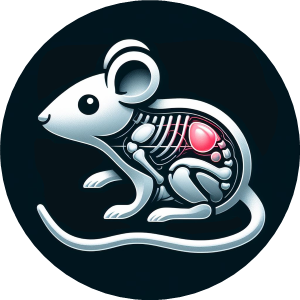

.. raw:: html
   

     <h1 style="margin: 0;">Small Animal Imaging Lab</h1>
     
   

The **Small Animal Imaging Lab**, in collaboration with the **NeuroWaves Lab** and the **Brain Imaging Lab**,
forms the Biomedical Imaging Core, one of twelve specialized facilities within the **Core Technology Platforms** (CTP) at NYU Abu Dhabi.

*Biomedical Imaging Core*

.. raw:: html

CTP encompasses a **wide range of advanced instrumentation**, supported by a team of **dedicated scientists** and **technical**
**experts** who manage equipment maintenance, provide comprehensive user training, and facilitate research operations across
the university.
For more information about available technologies and support services, please visit the CTP website:
https://nyuad.nyu.edu/en/research/facilities-and-support/core-technology-platforms.html

.. image:: _static/core_technology_platforms.png
   :alt: *NYUAD Core Technology Platforms*
   :width: 1000px
   :align: center

*NYUAD Core Technology Platforms*

.. raw:: html

Core team
---------
.. image:: _static/Maylis.jpg
   :alt: *Maylis Boitet, DVM, PhD*
   :width: 1000px
   :align: center

*Maylis Boitet, DVM, PhD*

.. raw:: html

Since August 2023, Dr. Boitet has served as the inaugural **Research Instrumentation Scientist** for the Small Animal Imaging
Lab at New York University Abu Dhabi (NYUAD). She earned her Ph.D. from Institut Pasteur Korea, where she characterized
a reporter mouse model for neuroinflammation using in vivo optical imaging. Her research focuses on **neuroscience** and optical
imaging, with particular emphasis on the application of **advanced imaging modalities** to study brain function in preclinical
models. Dr. Boitet also holds a **Doctor of Veterinary Medicine** (DVM) degree from VetAgro Sup in Lyon. At NYUAD, she actively
collaborates with researchers to integrate **non-invasive imaging strategies** into preclinical research studies.
For any inquiries regarding the Small Animal Imaging Lab, please contact her at maylis.boitet@nyu.edu.

Location
--------
The Small Animal Imaging Core is located within the **AAALAC-accredited vivarium** in Basement Level 2 of the Experimental
Research Building, C1 at New York University Abu Dhabi, UAE.

.. toctree::
    :caption: Lab Overview
    :hidden:

    1-lab-overview/SAI_lab_presentation.rst
    1-lab-overview/SAI_general_policies.rst
    1-lab-overview/SAI_scheduling.rst
    1-lab-overview/SAI_publications.rst
    1-lab-overview/SAI_useful_links.rst

.. toctree::
    :caption: IVIS Spectrum
    :hidden:

    2-IVIS-Spectrum/system-specifications.rst
    2-IVIS-Spectrum/main-applications.rst
    2-IVIS-Spectrum/technology-overview.rst
    2-IVIS-Spectrum/best-practices.rst

.. toctree::
    :caption: SkyScan 1276
    :hidden:

    3-SkyScan-1276/system-specifications.rst
    3-SkyScan-1276/main-applications.rst
    3-SkyScan-1276/technology-overview.rst
    3-SkyScan-1276/best-practices.rst
    3-SkyScan-1276/CT-artifacts.rst

.. toctree::
    :caption: nVue-nVision
    :hidden:

    4-nVue-nVision/system-specifications.rst
    4-nVue-nVision/main-applications.rst
    4-nVue-nVision/technology-overview.rst
    4-nVue-nVision/best-practices.rst

.. toctree::
    :caption: Karl Storz endoscope
    :hidden:

    5-KS-endoscope/system-specifications.rst
    5-KS-endoscope/main-applications.rst
    5-KS-endoscope/technology-overview.rst
    5-KS-endoscope/best-practices.rst

.. toctree::
    :caption: Ultima 2Pplus
    :hidden:

    6-Ultima-2Pplus/system-specifications.rst
    6-Ultima-2Pplus/main-applications.rst
    6-Ultima-2Pplus/technology-overview.rst
    6-Ultima-2Pplus/best-practices.rst