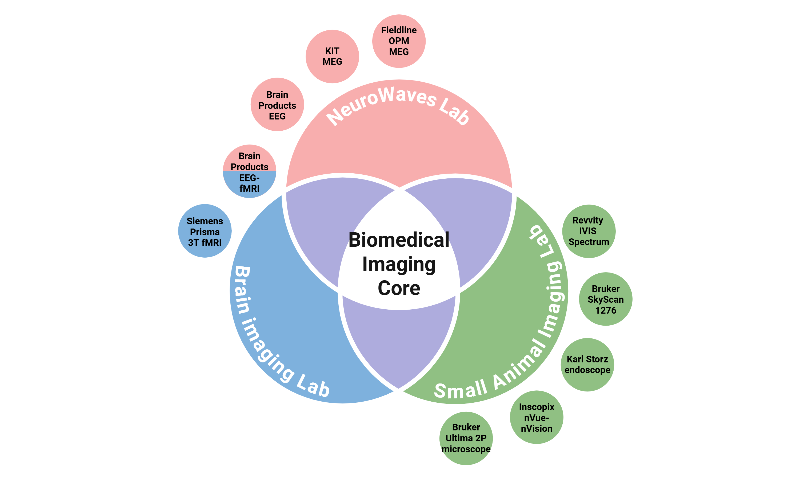
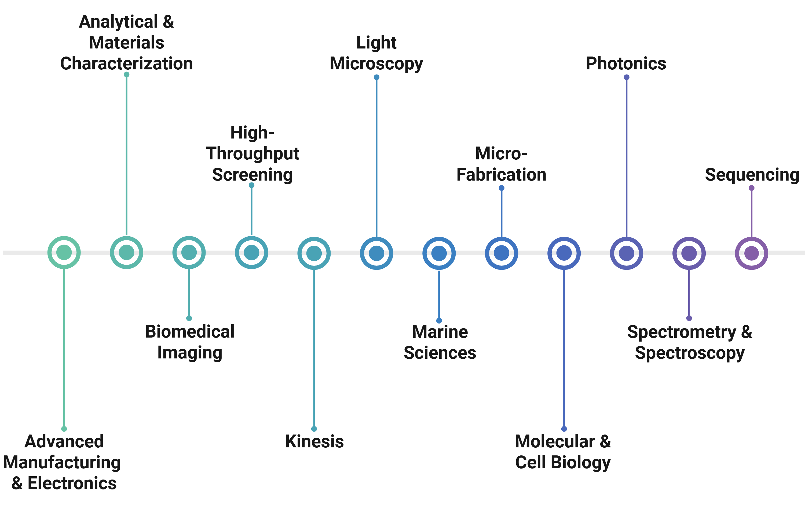
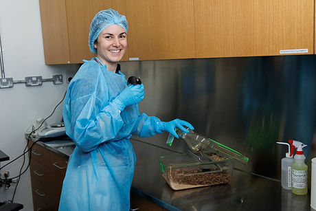

Small Animal Imaging Core
=========================

The **Small Animal Imaging Lab**, in collaboration with the **NeuroWaves Lab** and the **Brain Imaging Lab**, forms the Biomedical
Imaging Core, one of twelve specialized facilities within the **Core Technology Platforms** (CTP) at NYU Abu Dhabi.

*Biomedical Imaging Core*

.. raw:: html

CTP encompasses a wide range of advanced instrumentation, supported by a team of dedicated scientists and technical
experts who manage equipment maintenance, provide comprehensive user training, and facilitate research operations across
the university.
For more information about available technologies and support services, please visit the CTP website:
https://nyuad.nyu.edu/en/research/facilities-and-support/core-technology-platforms.html

*NYUAD Core Technology Platforms*

.. raw:: html

Core team
---------

*Maylis Boitet, DVM, PhD*

.. raw:: html

Since August 2023, Dr. Boitet has served as the inaugural **Research Instrumentation Scientist** for the Small Animal Imaging
Lab at New York University Abu Dhabi (NYUAD). She earned her Ph.D. from Institut Pasteur Korea, where she characterized
a reporter mouse model for neuroinflammation using in vivo optical imaging. Her research focuses on **neuroscience** and optical
imaging, with particular emphasis on the application of **advanced imaging modalities** to study brain function in preclinical
models. Dr. Boitet also holds a **Doctor of Veterinary Medicine** (DVM) degree from VetAgro Sup in Lyon. At NYUAD, she actively
collaborates with researchers to integrate **non-invasive imaging strategies** into preclinical research studies.
For any inquiries regarding the Small Animal Imaging Lab, please contact her at `maylis.boitet@nyu.edu <mailto:maylis.boitet@nyu.edu>`_.

Location
--------
The Small Animal Imaging Core is located within the **AAALAC-accredited vivarium** in Basement Level 2 of the Experimental
Research Building, C1 at New York University Abu Dhabi, UAE.

Documentation content
---------------------

.. toctree::
    :caption: Lab Overview

    1-lab-overview/SAI_lab_presentation
    1-lab-overview/SAI_general_policies
    1-lab-overview/SAI_scheduling
    1-lab-overview/SAI_publications
    1-lab-overview/SAI_useful_links

.. toctree::
    :caption: Imaging Technology

    2-Available-technology/IVIS_Spectrum
    2-Available-technology/SkyScan_1276
    2-Available-technology/nVue-nVision
    2-Available-technology/KarlStorz_small_animal_endoscope

.. toctree::
    :caption: Technology Principles

    3-Technology-principles/Optical_imaging
    3-Technology-principles/MicroCT
    3-Technology-principles/Miniscope_imaging
    3-Technology-principles/Endoscopy
